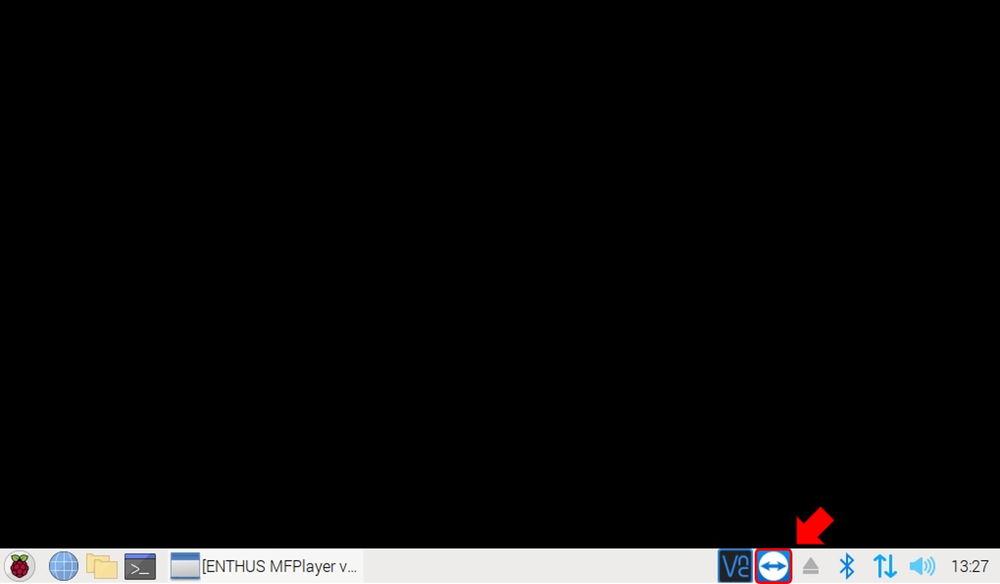
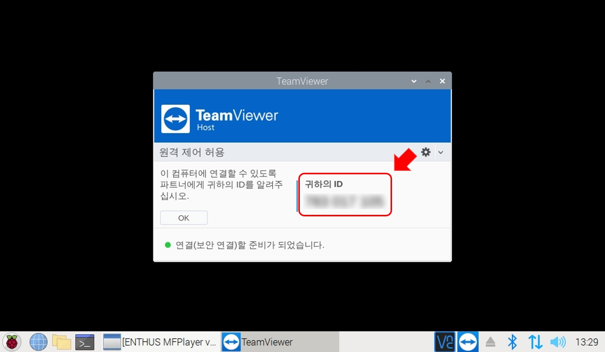
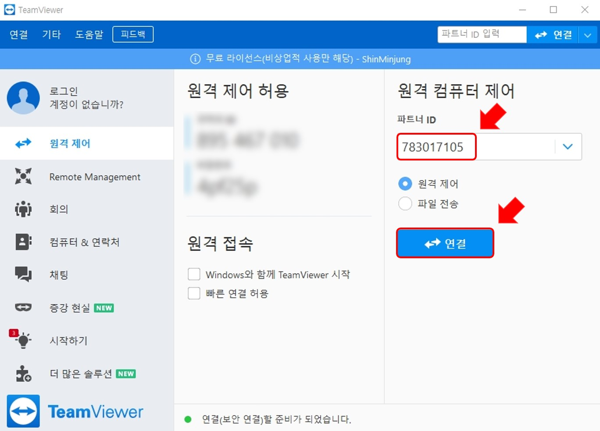
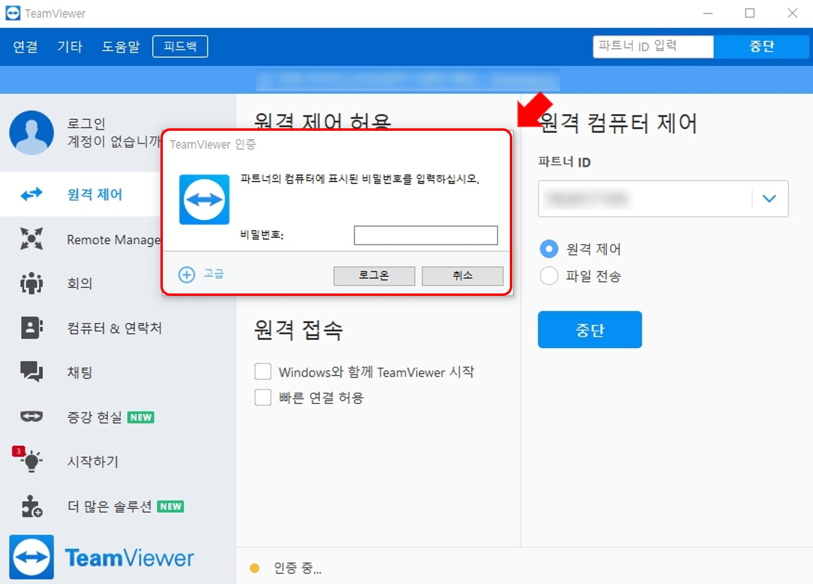

# 원격 제어
TeamViewer를 통해 MFPlayer를 원격으로 제어할 수 있습니다.

## MFPlayer
MFPlayer의 화면에서 TeamViewer를 실행시킵니다.

ID를 확인합니다.

## 컴퓨터

원격 제어를 이용할 컴퓨터의 TeamViewer를 실행시킨 뒤 MFPlayer에서 확인한 ID를 입력하여 연결합니다.

설정된 비밀번호를 입력하고 로그온 하면 MFPlayer를 컴퓨터로 원격 제어를 할 수 있습니다.

