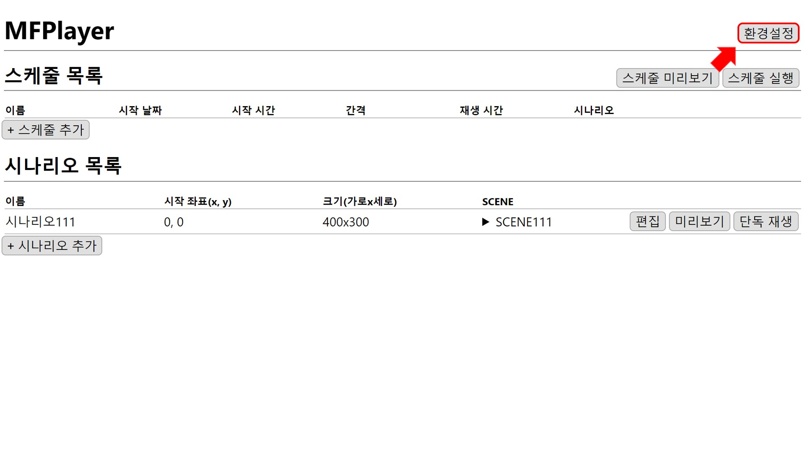
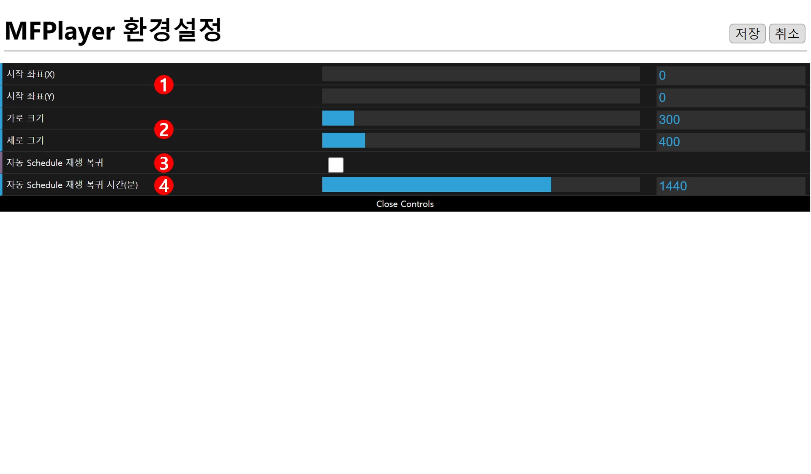
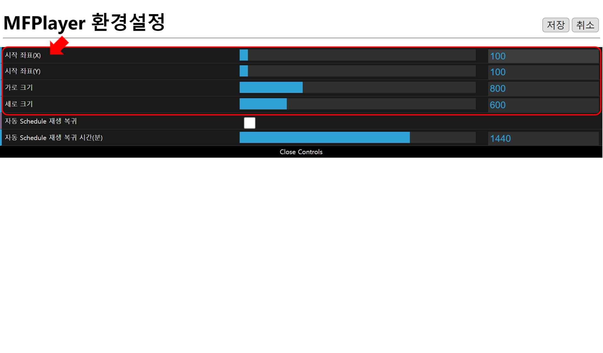
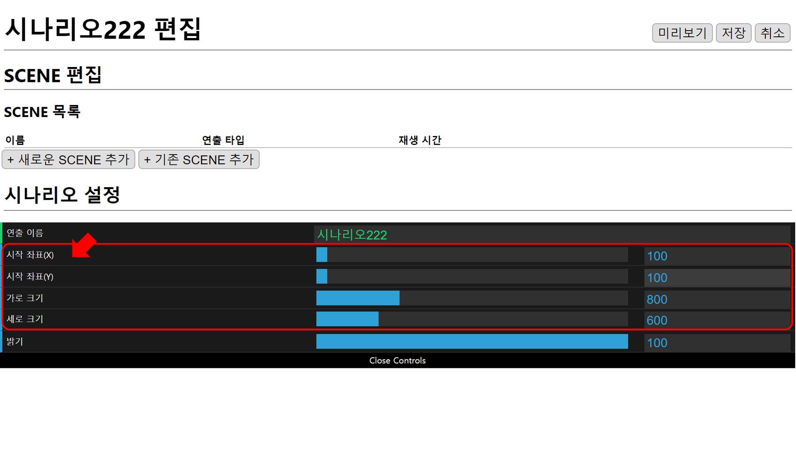
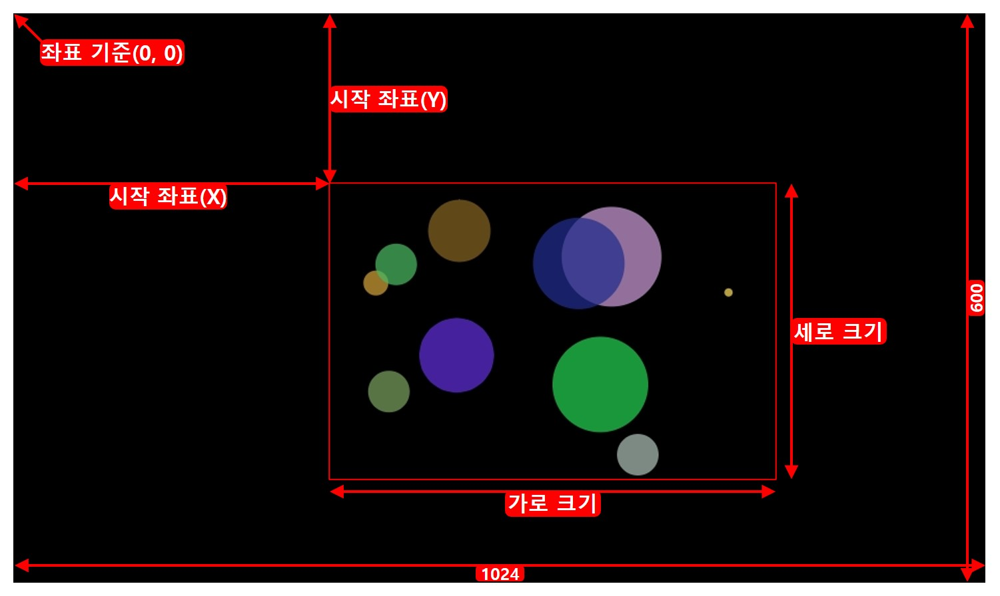

# 환경설정
홈 화면에서 `환경 설정`버튼을 누릅니다.

### 좌표와 크기
환경설정의 좌표와 크기는 새로운 시나리오를 만들 때 좌표와 크기의 기본값으로 사용됩니다.

시나리오 설정과 동일하게 1024x600 범위 내로 설정해야 하며 초과하면 저장할 수 없습니다.

## 1. 좌표
왼쪽 위 모서리(0,0)를 기준으로 (x,y) 좌표를 설정합니다.

## 2. 크기
설정한 **1.좌표**를 기준으로 재생될 크기를 설정합니다.

## 3. 자동 Schedule 재생 복귀
체크되어 있으면 단독 재생 중 **4. 자동 Schedule 재생 복귀 시간(분)**이 지나면 정해진 스케줄 재생으로 복귀합니다.

## 4. 자동 Schedule 재생 복귀 시간(분)
스케줄로 재생으로 자동으로 복귀될 시간을 설정합니다.
