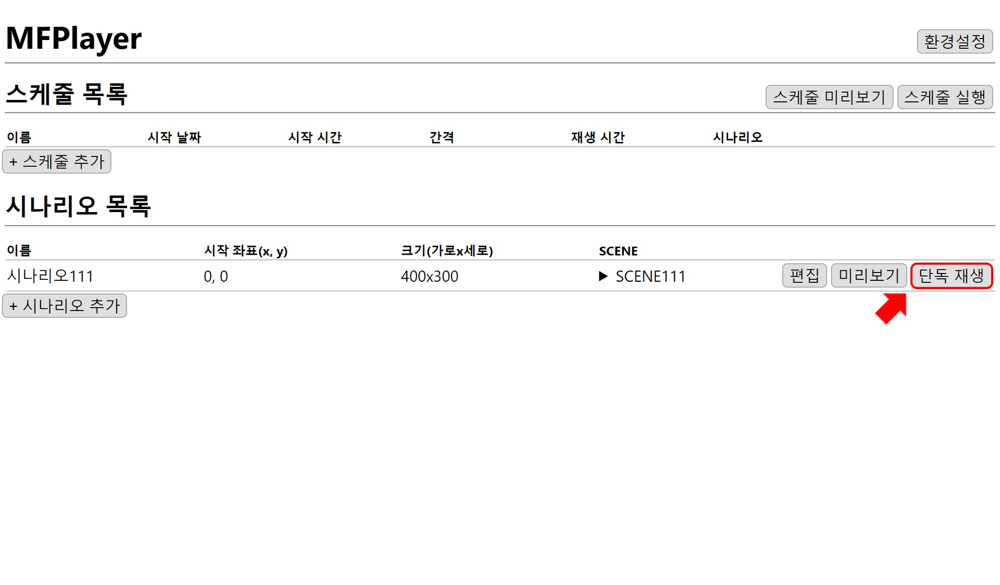
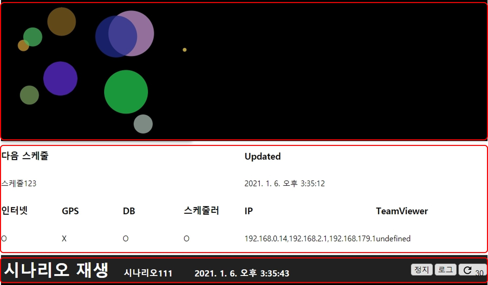
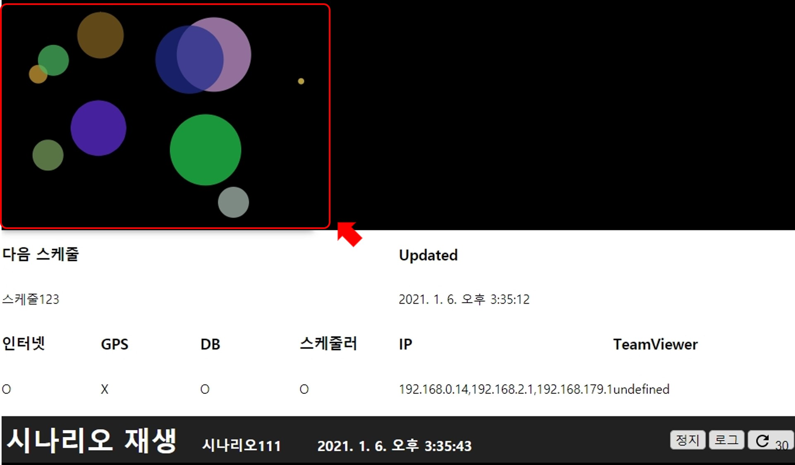
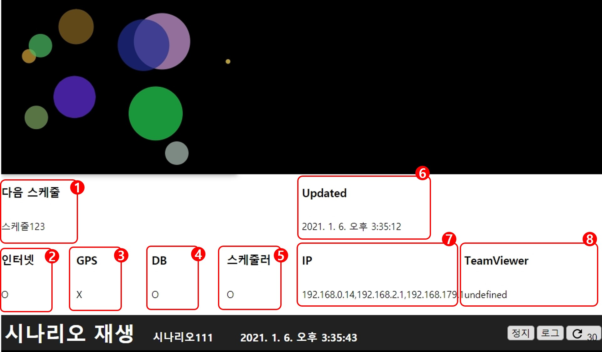
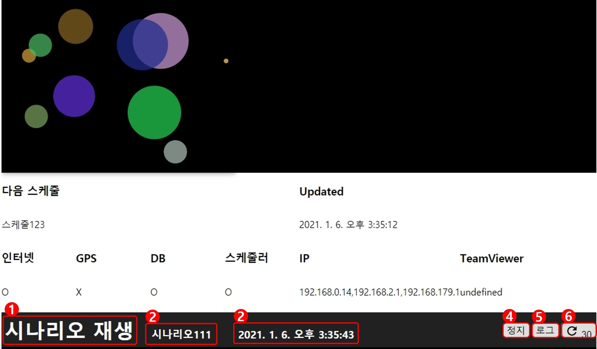

# 제어창
홈 화면에서 시나리오의 `단독재생`버튼을 누르면 제어창이 표시됩니다.

단독 재생 제어창은 **재생 화면**, **현재 상태**, **제어탭** 으로 구성되어 있습니다.

## 재생 화면
선택한 시나리오에 저장된 화면이 재생됩니다.

재생화면은 해당 시나리오에 설정된 크기와 좌표에 맞게 재생됩니다.

## 현재 상태

### 1. 다음 스케줄
현재 실행 중인 스케줄 다음으로 실행될 스케줄의 이름이 표시됩니다.

### 2. 현재 인터넷 연결 상태

### 3. 현재 GPS 연결 상태

### 4. 현재 DB 연결 상태

### 5. 현재 스케줄러 연결 상태

### 6. 최종 업데이트된 시간

### 7. 현재 IP

### 8. 현재 Team Viewer

## 제어탭

### 1. 재생 중인 타입
지금 재생 중인 상태의 타입 **시나리오 재생**/**스케줄 재생** 이 표시됩니다.
현재는 시나리오의 단독 재생 버튼을 누른 상태이므로 시나리오 재생이 표시되고 있습니다.

### 2. 이름
재생 중인 시나리오/스케줄의 이름이 표시됩니다.

### 3. 시간
현재 시간이 표시됩니다.

### 4. 정지
재생 화면이 닫히고 다시 이전 화면으로 돌아갑니다.

### 5. 로그
버튼을 누르면 로그를 확인할 수 있습니다.

### 6. 새로 고침
새로 고침까지 남은 시간이 표시되고 버튼을 누르면 즉시 새로 고침됩니다.
