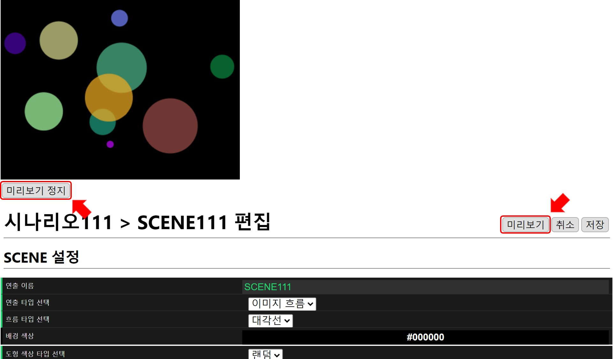

# 원 아이콘의 대각선 흐름
다양한 크기의 원이 대각선으로 움직이는 연출입니다.
원의 크기, 속도, 방향이 랜덤하게 움직여 자연스러운 변화를 표현할 수 있습니다.

MFPlayer 의 연출은 시나리오와 SCENE 으로 구성되어 있습니다.
아래의 설정 과정을 통해 MFPlayer 의 기본 연출 구조를 배울 수 있습니다.

## 시나리오 추가
SCENE 은 연출의 가장 최소 단위입니다. 시나리오는 SCENE 들의 모음입니다.
MFPlayer 는 시나리오 단위로 재생합니다. 시나리오는 하나의 SCENE 으로 구성될 수도 있습니다.
새로운 연출 작성은 새로운 시나리오를 만드는 것으로 시작합니다.

홈 화면에서 `시나리오 추가` 버튼을 클릭합니다.

## SCENE 추가 
`새로운 SCENE 추가` 버튼을 눌러 새로운 SCENE을 추가합니다.

## SCENE 설정
SCENE 설정 화면은 아래와 같습니다.
순서에 맞게 SCENE 연출 설정을 하고 `미리보기`로 설정 내역을 확인합니다.
설정이 완료되면, `저장` 버튼을 눌러 시나리오에 새로운 SCENE 을 추가합니다.

### 1. 연출 타입 선택
MFPlayer 의 기본 연출 타입을 선택합니다.
**파일 재생**, **이미지 흐름**, **색상 흐름** 의 연출 타입이 있습니다.
아이콘을 설정하기 위해서 `이미지 흐름`을 선택합니다.

### 2. 흐름 타입 선택
아이콘의 흐름 타입을 선택합니다.
**대각선**, **오른쪽**, **왼쪽**, **위**, **아래** 의 연출 타입이 있습니다.
아이콘의 대각선 흐름을 위해서 `대각선`을 선택합니다.

### 3. 아이콘 선택 
편집 화면을 스크롤해 올리면 다양한 아이콘들을 확인할 수 있습니다.
예시에서는 원형 아이콘을 선택합니다.

### 4. SCENE 미리보기
SCENE 편집 완료 후 `미리보기` 버튼을 누르면 재생 화면이 나타나 편집 결과를 확인할 수 있습니다.
`미리보기 정지`로 재생 화면이 닫힙니다.

원하는 형태의 연출이 될때까지 `미리보기`를 통해 반복적으로 빠른 수정 - 확인이 가능합니다.

## SCENE 저장
`저장` 버튼을 누르면 설정된 SCENE 저장되고 시나리오에 추가됩니다.

시나리오에 SCENE이 추가된 것을 확인할 수 있습니다.

## 시나리오 설정

### 1. 재생 시간
SCENE의 재생 시간을  `▲` `▼` 버튼을 이용해 초 단위로 조절합니다.

### 2. 재생 화면 크기
시나리오에서 SCENE이 재생될 크기를 설정합니다.

## 시나리오 미리보기

시나리오 편집 완료 후 `미리보기` 버튼을 누르면 재생 화면이 나타나 편집 결과를 확인할 수 있습니다.

`미리보기 정지`로 재생 화면이 닫힙니다.

재생 시간이 끝나면 다시 반복됩니다.

## 시나리오 저장
`저장` 버튼을 누르면 설정된 시나리오가 저장되고 시나리오가 생성됩니다.

시나리오 목록에 시나리오가 추가된 것을 확인할 수 있습니다.

## 시나리오 단독 재생

홈 화면의 목록에서 `단독 재생` 버튼을 누르면 선택한 시나리오 하나만 재생됩니다.

재생화면과 함께 재생 상태를 확인할 수 있습니다.

재생 중 `정지`버튼을 누르면 재생을 멈추고 홈 화면으로 돌아갑니다.

### 1. 재생 화면
선택한 시나리오에 저장된 화면이 재생됩니다.

### 2. 재생
**스케줄 재생**, **시나리오 재생** 을 표시해 지금 재생되는 타입을 나타냅니다. 현재는 시나리오의 단독 재생 버튼을 누른 상태이므로 시나리오 재생이 표시됩니다.

### 3. 현재 재생중인 이름
재생 중인 시나리오의 이름이 표시됩니다.
