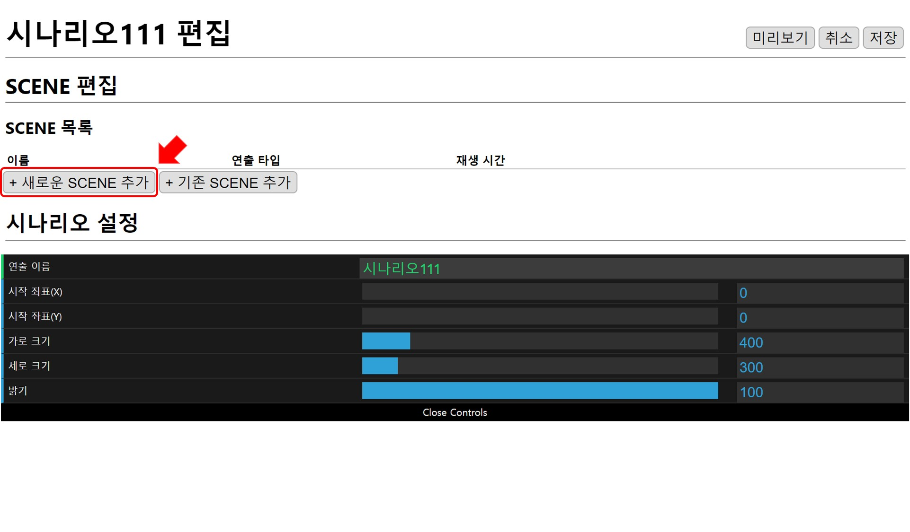
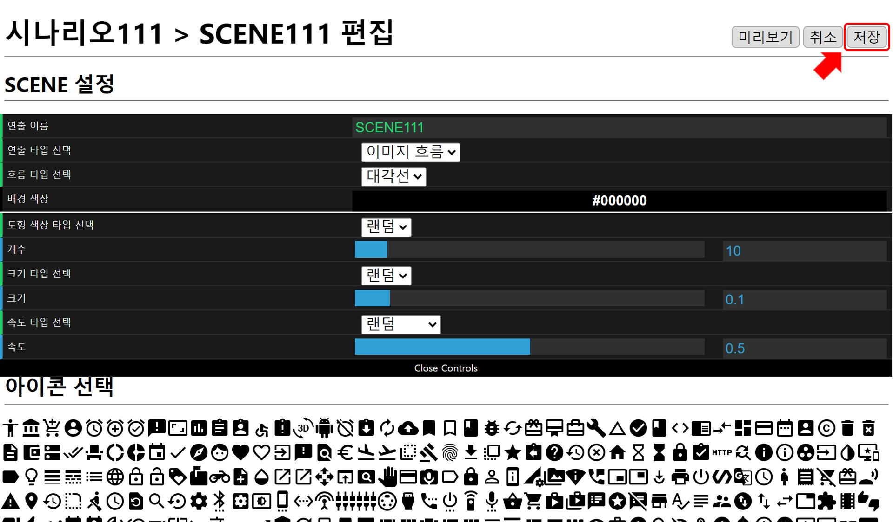
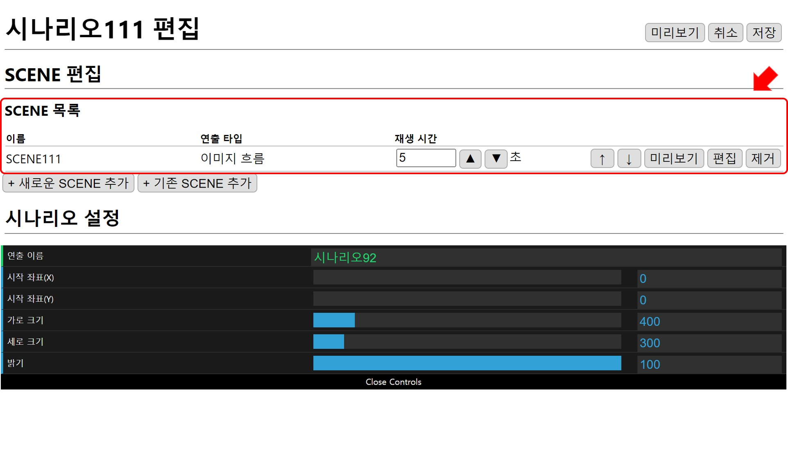

## 원 아이콘의 대각선 흐름

### 시나리오 추가
새로운 시나리오를 만듭니다.

### SCENE 추가 
시나리오에 새로운 SCENE을 추가합니다.

### SCENE설정 
1. 이미지 흐름 선택
2. 대각선 선택
3. 그려질 아이콘의 속성 결정

### 아이콘 선택 
원형 아이콘을 선택합니다.

### 검토
SCENE 편집 완료 후 `미리보기`로 확인하고 `미리보기 정지`로  재생화면을 닫을 수 있습니다.

### SCENE저장

### 결과 

시나리오에 SCENE이 추가된 것을 확인할 수 있습니다.

