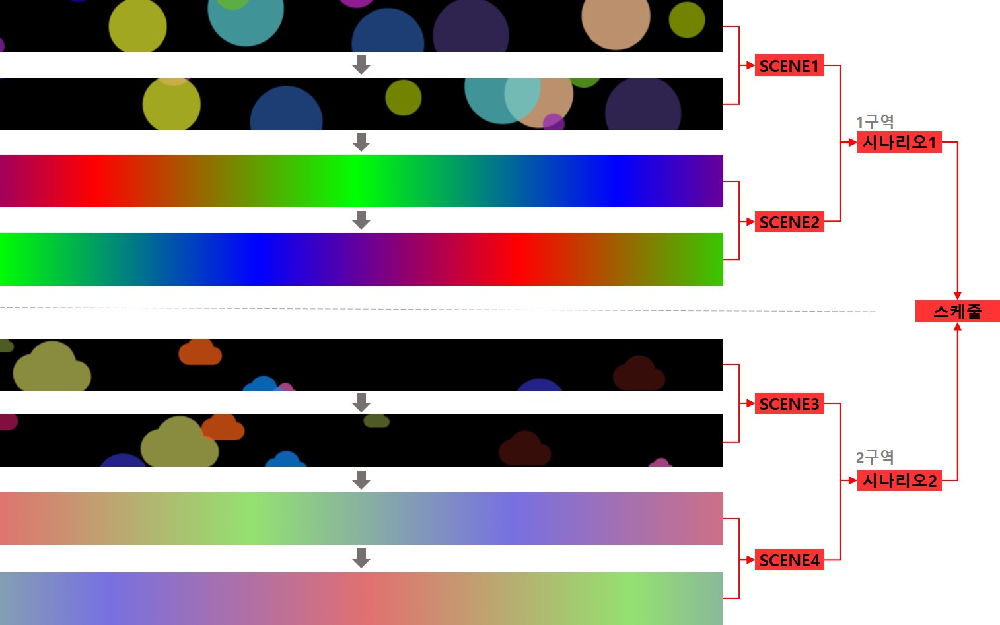

# MFPlayer
MFPlayer의 연출은 **스케줄**에 설정된 시간에 맞게 **SCENE으로 구성된 시나리오**를 각 구역에서 재생합니다.

# SCENE
MFPlayer 연출의 가장 최소 단위입니다.

# 시나리오
1개 이상의 SCENE들을 이어서 순서대로 재생하는 형태입니다. 스케줄에서 이 시나리오를 재생하게 됩니다. 

# 스케줄
시나리오를 언제 재생시킬지 재생할 시간을 설정합니다.
