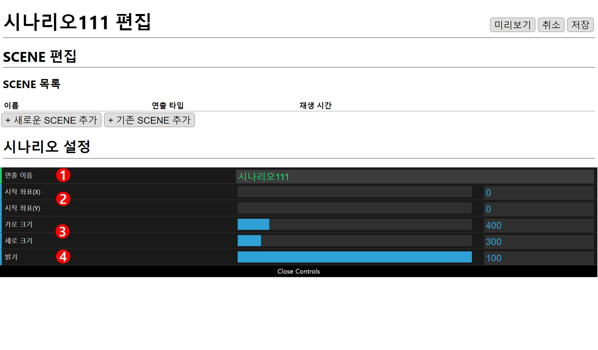
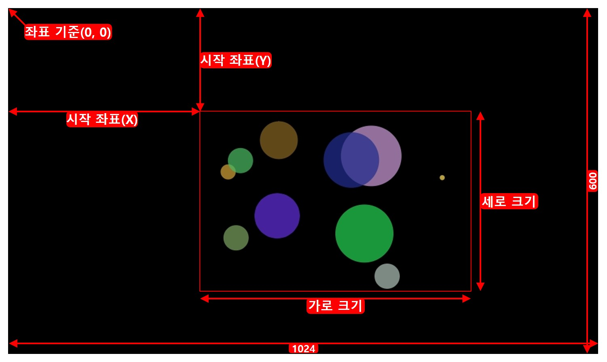

# 시나리오 설정

## 1. 연출 이름
이름은 랜덤으로 설정되기 때문에(편집 화면에서 수정 가능합니다.) 예시 그림의 이름과 다를 수 있습니다.

## 2. 좌표
왼쪽 위 모서리(0,0)를 기준으로 (x,y) 좌표를 설정합니다.

## 3. 크기
설정된 **2.좌표**를 기준으로 재생될 화면의 크기를 설정합니다.

### 좌표와 크기

좌표와 크기 설정은 1024x600 범위 내로 설정해야 하며 초과하면 저장할 수 없습니다.

## 4. 밝기
1~100 범위에서 1단위로 시나리오의 밝기를 설정합니다. 기본값은 100으로 설정되어 있습니다.
