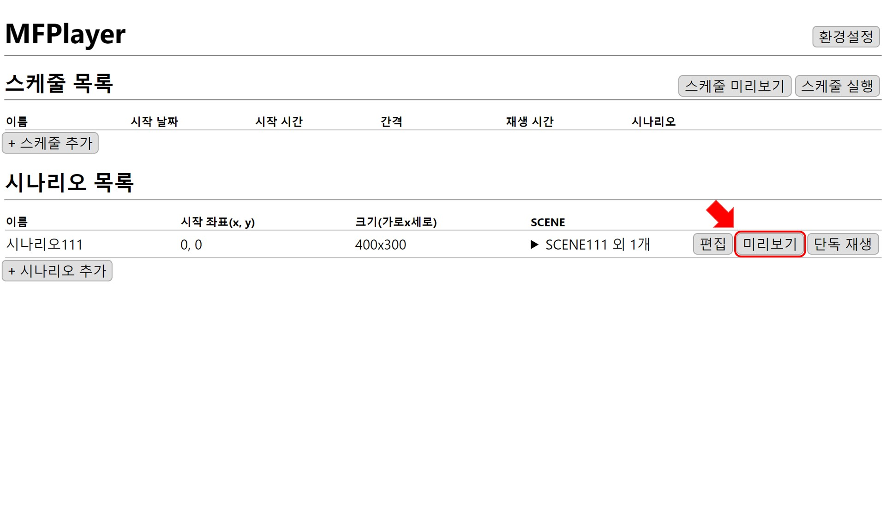
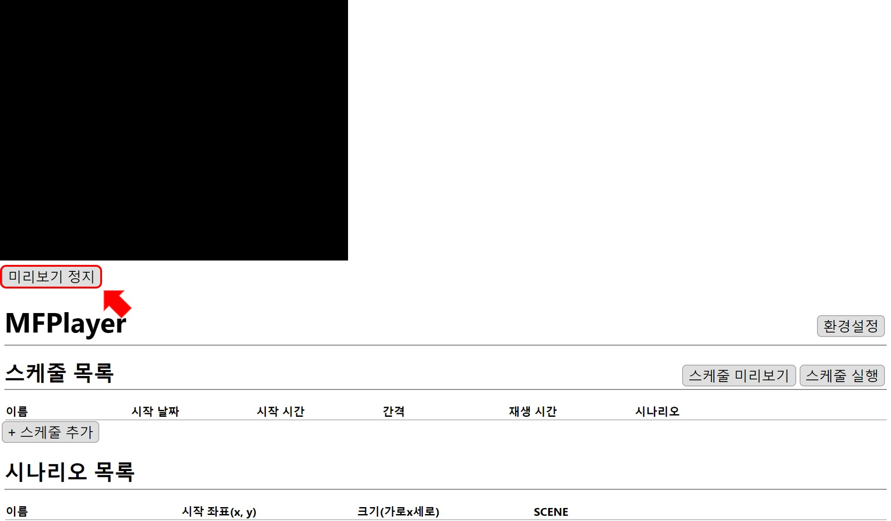
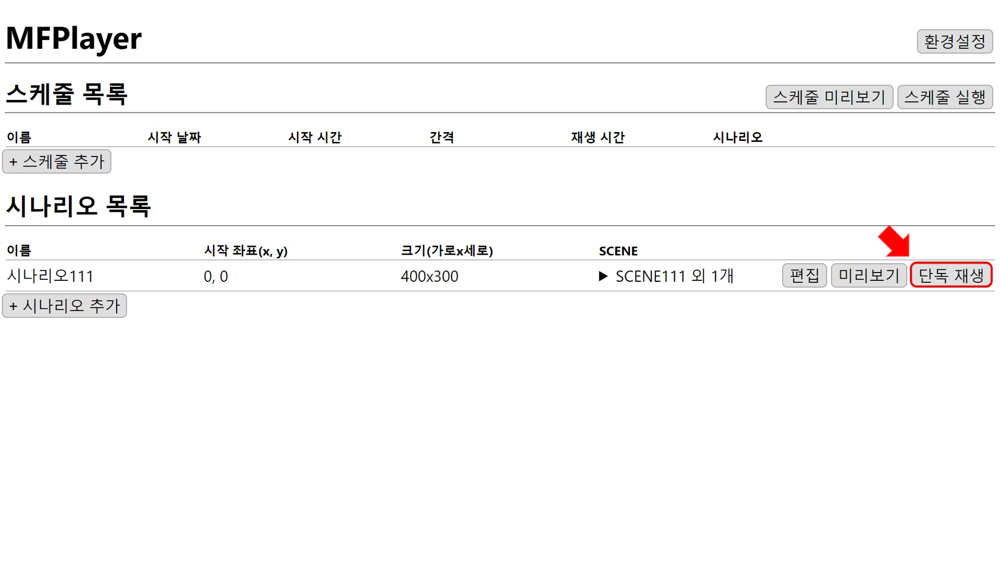
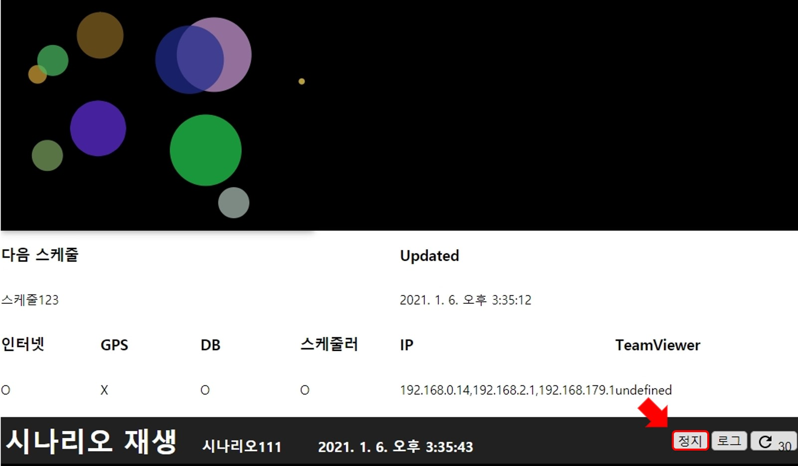

# 시나리오 재생

## 미리 보기
홈 화면에서 시나리오 목록 중에 재생하고 싶은 시나리오의 `미리보기`버튼을 누르면 편집창에서의 미리 보기와 마찬가지로 재생 화면이 나타납니다.

`미리보기 정지` 버튼을 누르면 재생 화면이 닫힙니다.

## 단독 재생
시나리오 하나를 스케줄과 관련 없이 단독으로 재생할 수 있습니다. 홈 화면의 시나리오 목록 중에 재생하고 싶은 시나리오의 `단독 재생` 버튼을 누르면 편집창이 닫히고, 선택한 시나리오가 재생됩니다.

시나리오가 재생되면서 하단에 제어 창이 열립니다. 제어 창에서 `정지` 버튼을 누르면 재생이 멈추고 다시 홈 화면으로 돌아옵니다.

단독 재생에 관련된 자세한 설명은 [제어창](../control/window.md)에서 확인하실 수 있습니다.
