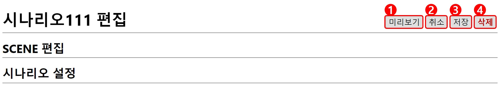
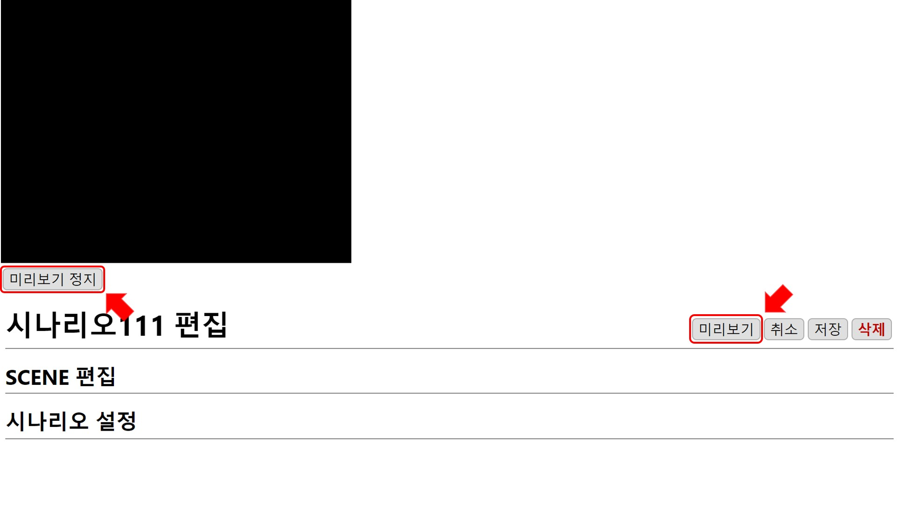

# 시나리오

## 시나리오 편집
편집창은 **현재 위치**, **SCENE 편집**, **시나리오 설정** 으로 구성되어 있습니다.

### 1. 미리보기
SCENE 편집 완료 후 `미리보기` 버튼을 누르면 재생 화면이 나타나 편집 결과를 확인할 수 있습니다.

`미리보기 정지` 버튼을 누르면 재생 화면이 닫힙니다.

### 2. 저장
편집된 시나리오를 저장합니다.

### 3. 취소
편집을 저장하지 않고 이전 화면으로 돌아갑니다.

### 4. 삭제
현재 편집 중인 시나리오를 삭제하고 이전 화면으로 돌아갑니다.
시나리오를 삭제하게 되면 삭제된 시나리오가 포함된 스케줄 내에 있는 시나리오 목록에서도 삭제됩니다.
