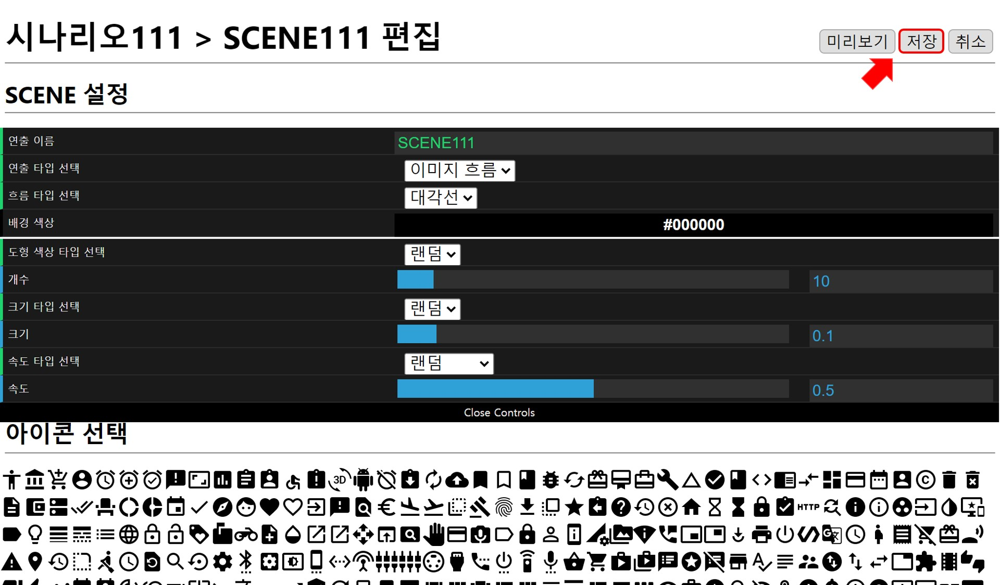
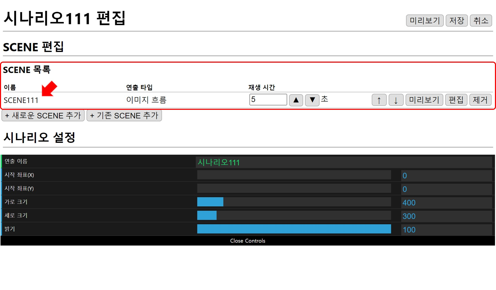
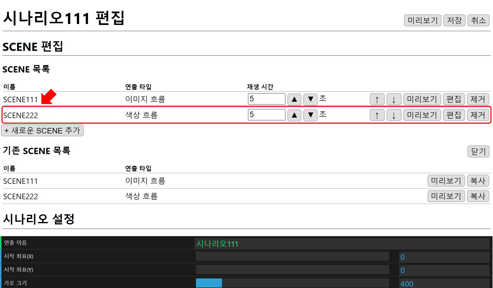
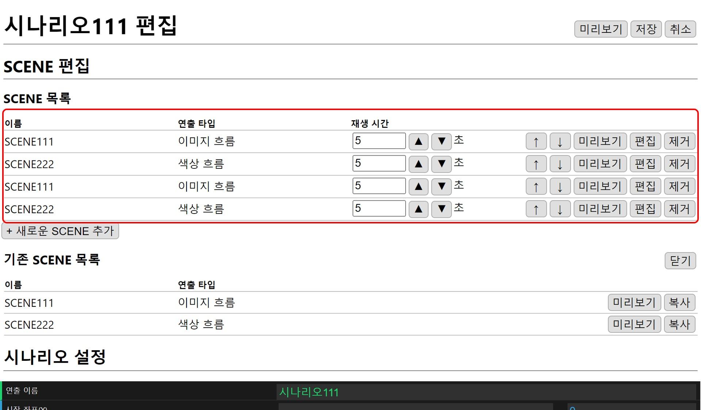
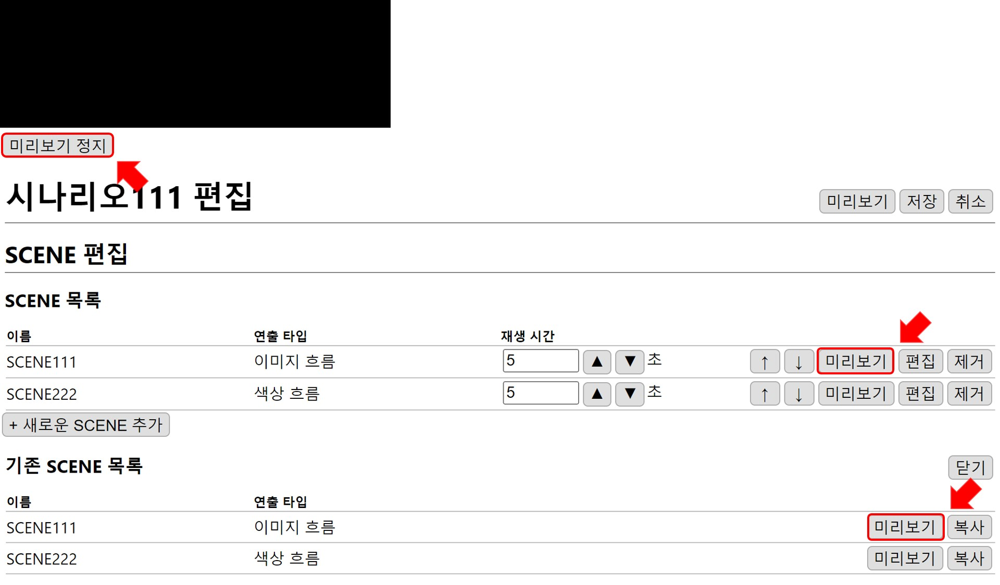

# SCENE 편집
시나리오에 SCENE을 입력하고 편집합니다.

## SCENE 추가
SCENE을 입력하는 방법에는 새로 만들어서 추가하는 방법인 **1. 새로운 SCENE 추가**와 기존에 만든 SCENE을 추가하는 **2. 기존 SCENE 추가** 방법이 있습니다. 

### 1. 새로운 SCENE 추가
`+ 새로운 SCENE 추가`버튼을 누르면 SCENE 편집창으로 이동합니다.

`저장`하면 시나리오의 **SCENE 목록**에 추가됩니다.

### 2. 기존 SCENE 추가
`+ 기존 SCENE 추가`버튼을 누르면 이전에 만들었던 **기존 SCENE 목록**이 나타납니다.

추가할 SCENE을 `복사`하면 **SCENE 목록**에 추가됩니다.

SCENE은 중복으로 추가 가능합니다.

## SCENE 목록
시나리오는 SCENE 목록 순서대로 각각 SCENE에 설정된 재생 시간 동안 재생됩니다.

### 1. 재생 시간
SCENE의 재생 시간은  `▲` `▼` 버튼을 이용해 0.1 초 단위로 조절 가능하고 최소 0.5초, 최대 86400초(24시간)로 설정할 수 있습니다.

### 2. 재생 순서
`↑` `↓` 버튼을 이용해 변경할 수 있습니다. 

### 3. 미리보기
미리 보기를 통해 SCENE을 확인할 수 있습니다. `미리보기 정지` 버튼을 누르면 재생 화면이 닫힙니다.

### 4. 편집
해당 SCENE의 편집창으로 이동합니다.

### 5. 제거
**SCENE 목록**에서 제거됩니다.
