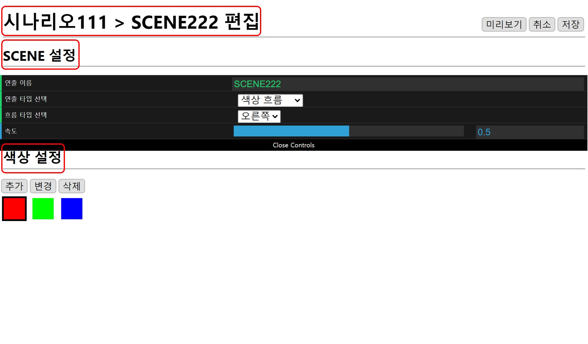
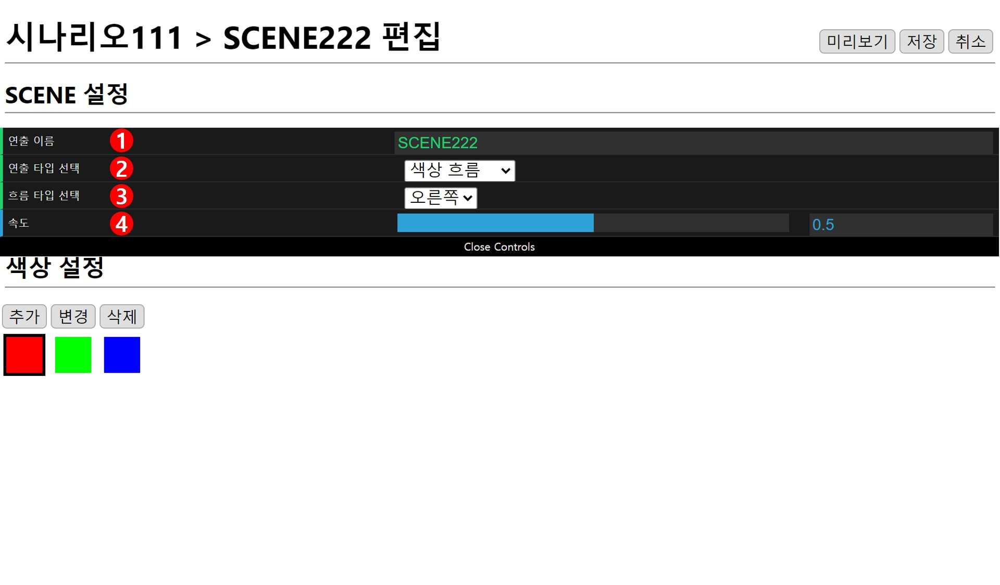
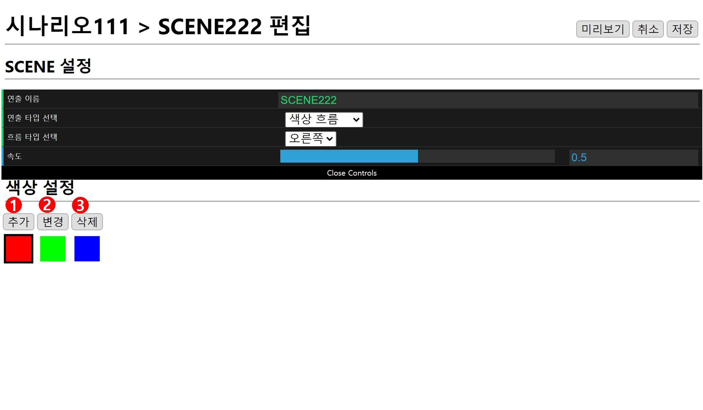
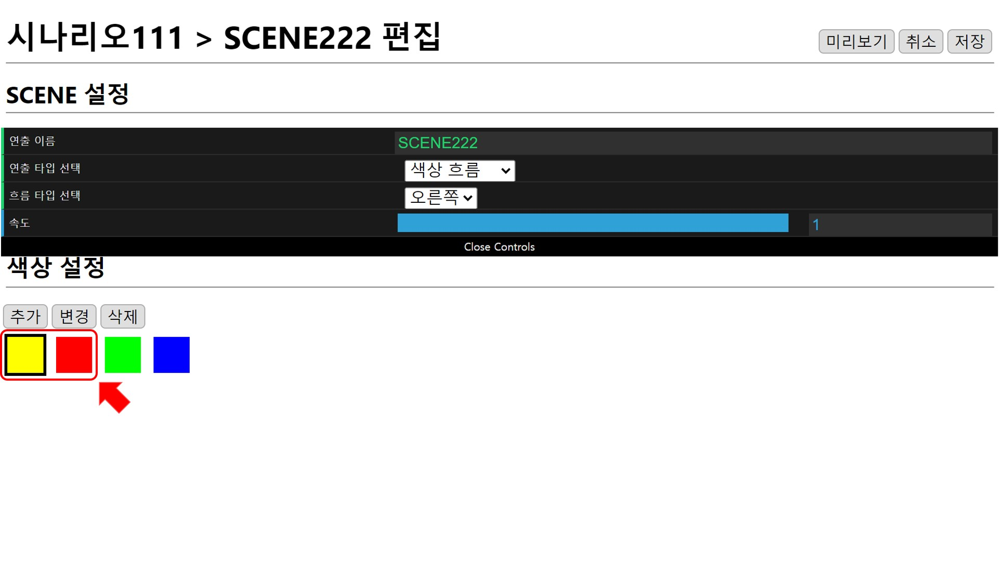

# 색상 흐름
편집창은 **현재 위치**, **SCENE 설정**, **색상 설정**으로 구성되어 있습니다.

## SCENE 설정

### 1. 연출 이름
이름은 랜덤으로 설정되기 때문에(편집 화면에서 수정 가능합니다.) 예시 그림의 이름과 다를 수 있습니다.

### 2. 연출 타입 선택
색상 연출을 위해 색상 흐름으로 선택합니다.

### 3. 흐름 타입 선택
색상이 흐르는 방향은 **오른쪽**, **왼쪽**, **위**, **아래** 중 선택할 수 있습니다.

### 4. 속도
색상이 흐르는 속도를 설정할 수 있습니다.

## 색상 설정

### 1. 추가
새로운 색상은 선택된 색상 앞으로 추가되므로 추가하고 싶은 곳의 바로 뒤 색상을 선택하고 `추가`버튼을 누릅니다.

* 예시:  빨강 선택 ->  추가 -> 노랑 선택

### 2. 변경
변경하고 싶은 색상을 선택한 뒤 `변경`버튼을 누르고 원하는 색상으로 변경합니다.

### 3. 삭제
선택된 색상이 삭제됩니다.
