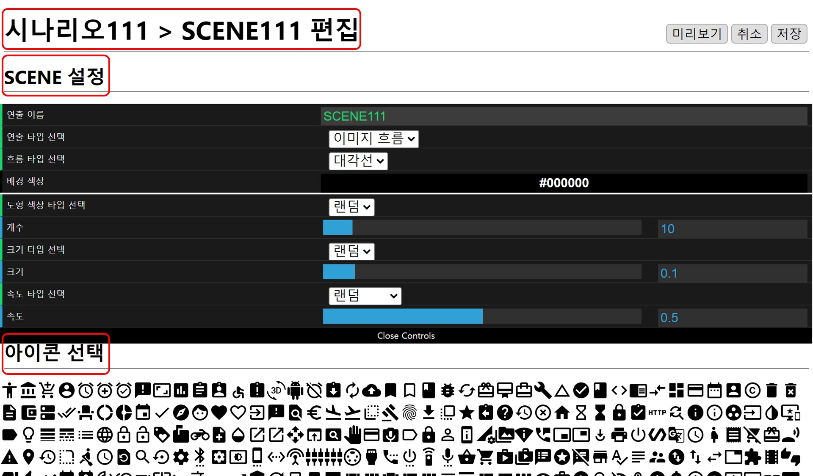
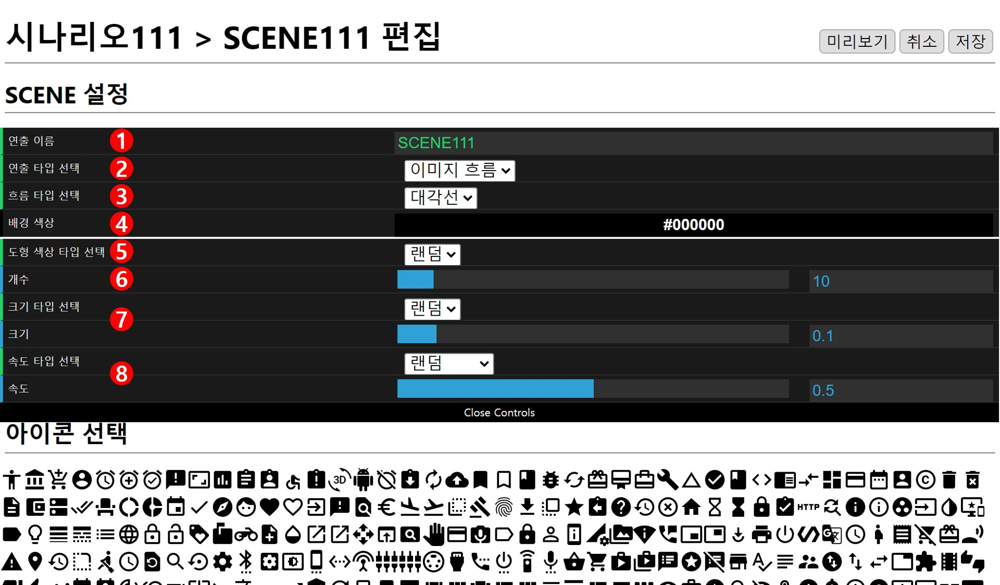
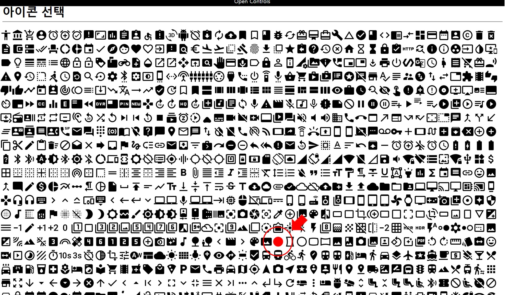

# 이미지 흐름
편집창은 **현재 위치**, **SCENE 설정**, **아이콘 선택** 으로 구성되어 있습니다.

## SCENE 설정

### 1. 연출 이름
이름은 랜덤으로 설정되기 때문에(편집 화면에서 수정 가능합니다.) 예시 그림의 이름과 다를 수 있습니다.

### 2. 연출 타입 선택
아이콘 연출을 위해 이미지 흐름으로 선택합니다.

### 3. 흐름 타입 선택
아이콘이 흐르는 방향은 **대각선**, **오른쪽**, **왼쪽**, **위**, **아래** 중 선택할 수 있습니다.

### 4. 배경 색상
재생 화면의 배경 색상을 선택합니다.

### 5. 도형 색상 타입 선택, 이미지 색상
**랜덤**, **고정** 중 선택할 수 있고 고정으로 바꾸게 이미지 색상 탭이 나타나 색상을 선택할 수 있습니다.

### 6. 개수
재생 화면에 표시할 아이콘의 개수를 선택할 수 있고 최소 1개, 최대 100개로 설정 가능합니다.

### 7. 크기 타입 선택, 크기
아이콘의 크기를 결정하고 **랜덤**, **고정** 중 선택할 수 있습니다.
* 랜덤: 크기의 값에 비례한 범위 안에서 랜덤으로 설정됩니다
* 고정: 전체 크기가가 고정됩니다.

### 8. 속도 타입 선택, 속도
아이콘의 속도를 결정하고 **랜덤**, **고정**, **크기 비례** 중 선택할 수 있습니다.
* 랜덤: 속도의 값에 비례한 범위 안에서 랜덤으로 설정됩니다.
* 고정: 전체 속도가 고정됩니다.
* 크기 비례 : 속도의 값에 비례한 범위 안에서 크기가 커질수록 속도가 빨라집니다.

## 아이콘 선택
여러가지 아이콘중 선택한 아이콘은 색상이 변하게됩니다.

