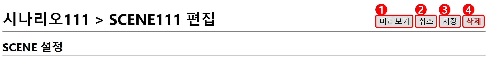
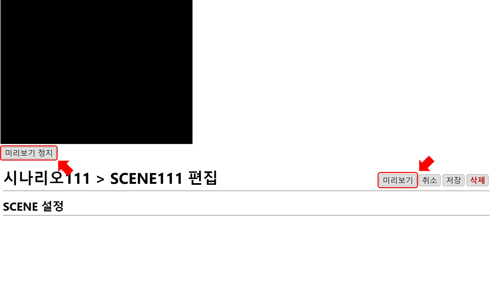

# SCENE 

## SCENE 타입

### 이미지 흐름
아이콘의 모양과 흐름 방향을 선택해 연출합니다. [이미지 흐름](./icon.md)

### 색상 흐름
여러 가지 색상을 조합해 색상 흐름을 연출합니다. [색상 흐름](./gradient.md)

### 영상 파일
영상 파일을 선택해 재생합니다. [영상 파일](./video.md)

## SCENE 편집
편집창은 **현재 위치**와 **SCENE 설정** 으로 구성되어 있습니다.

### 1. 미리 보기
SCENE 편집 완료 후 `미리보기` 버튼을 누르면 재생 화면이 나타나 편집 결과를 확인할 수 있습니다.

`미리보기 정지` 버튼을 누르면 재생 화면이 닫힙니다.

### 2. 저장
편집된 SCENE을 저장합니다.

### 3. 취소
편집을 저장하지 않고 이전 화면으로 돌아갑니다.

### 4. 삭제
현재 편집 중인 SCENE을 삭제하고 이전 화면으로 돌아갑니다.
SCENE을 삭제하게 되면 삭제된 SCENE이 포함된 시나리오 내에 있는 SCENE 목록에서도 삭제됩니다.
