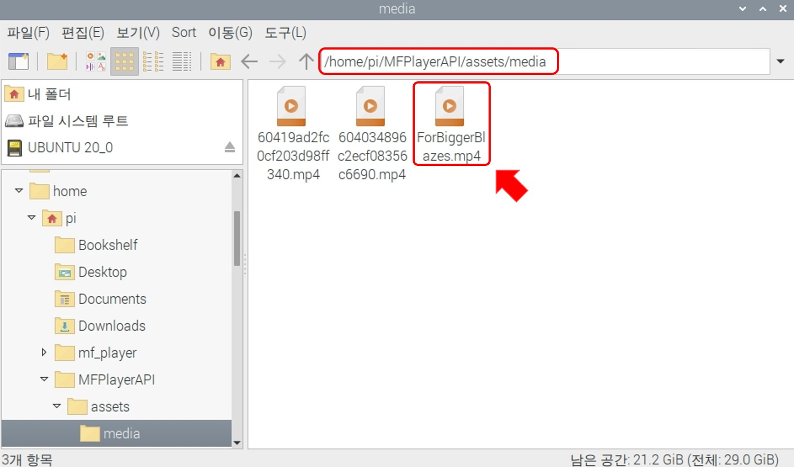

# 영상 파일
편집창은 **현재 위치**, **SCENE 설정**, **파일 선택** 으로 구성되어 있습니다.

## SCENE 설정

### 1. 연출 이름
이름은 랜덤으로 설정되기 때문에(편집 화면에서 수정 가능합니다.) 예시 그림의 이름과 다를 수 있습니다.

### 2. 연출 타입 선택
영상 연출을 위해 영상파일을 선택합니다.

## 영상 파일

### 파일 가져오기
재생할 파일이 담긴 USB 메모리를 MFPlayer의 오른쪽 위 USB 포트에  연결합니다.

### 파일 선택
USB를 연결한 후 `파일 선택`을 눌러 영상파일을 가져옵니다.

재생할 파일을 선택해 `열기` 버튼으로 추가합니다.

영상 파일 이름이 표시돼 추가된 것을 확인할 수 있습니다.

저장된 영상파일의 링크는 아래와 같습니다.

