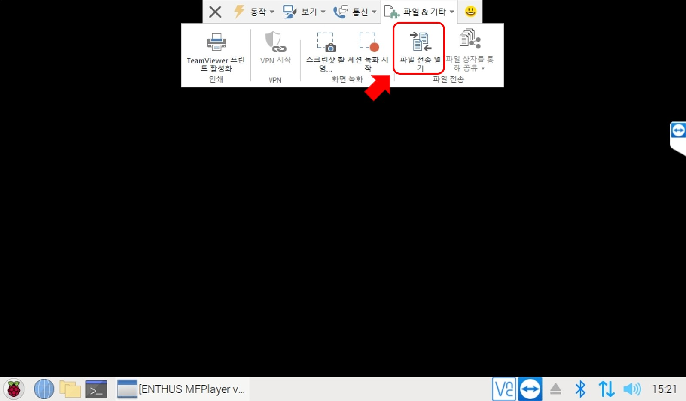
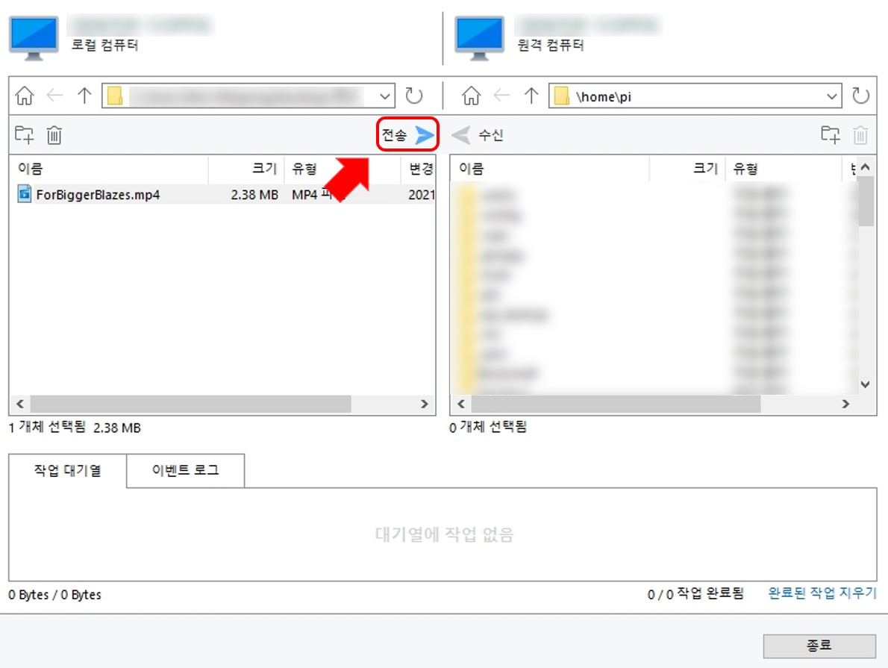

# 영상 파일
편집창은 **현재 위치**, **SCENE 설정**, **파일 선택** 으로 구성되어 있습니다.

## SCENE 설정

### 1. 연출 이름
이름은 랜덤으로 설정되기 때문에(편집 화면에서 수정 가능합니다.) 예시 그림의 이름과 다를 수 있습니다.

### 2. 연출 타입 선택
영상 연출을 위해 영상파일을 선택합니다.

### 3. 파일 선택
영상 연출을 위해 영상파일을 선택합니다.

#### USB
재생할 파일이 담긴 USB 메모리를 MFPlayer의 오른쪽 위 USB 포트에 연결합니다.

USB를 연결한 후 `3. 파일 선택`을 눌러 영상파일을 가져옵니다.

재생할 파일을 선택해 `열기` 버튼으로 추가합니다. 파일은 USB를 제거해도 삭제되지 않습니다.

영상 파일 이름이 표시돼 추가된 것을 확인할 수 있습니다.

#### 원격제어

원격제어 연결법은 [원격 제어](../control/remote.md) 탭에서 확인할 수 있습니다.

TeamViewer의 **파일 & 기타** 탭의 `파일 전송 열기`버튼을 누릅니다.

MFPlayer로 전송할 파일을 선택 후 `전송`버튼을 누릅니다.

파일이 원격 컴퓨터로 전송된 것을 확인할 수 있습니다.

파일이 전송 완료되면 받은 파일을 MFPlayer의 `3.파일 선택`으로 불러올 수 있습니다.
