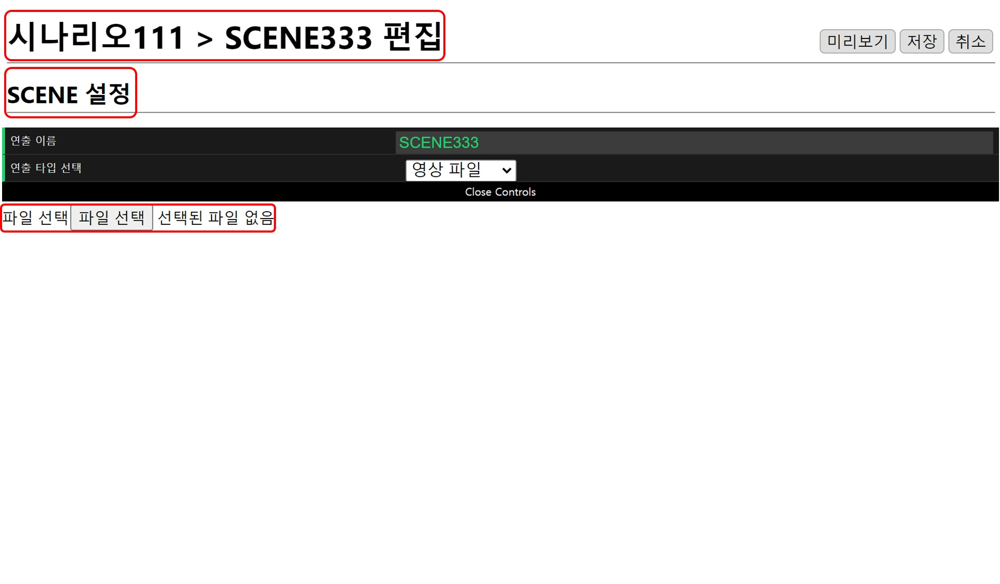
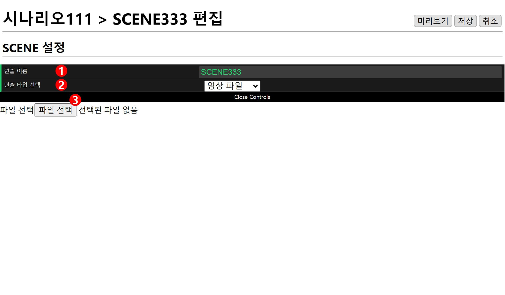

# 영상 파일
편집창은 **현재 위치**, **SCENE 설정**, **파일 선택** 으로 구성되어 있습니다.

## SCENE 설정

### 1. 연출 이름
이름은 랜덤으로 설정되기 때문에(편집 화면에서 수정 가능합니다.) 예시 그림의 이름과 다를 수 있습니다.

### 2. 연출 타입 선택
영상 연출을 위해 영상파일을 선택합니다.

## 파일 선택
`파일 선택`을 눌러 영상파일을 불러올 수 있습니다.

