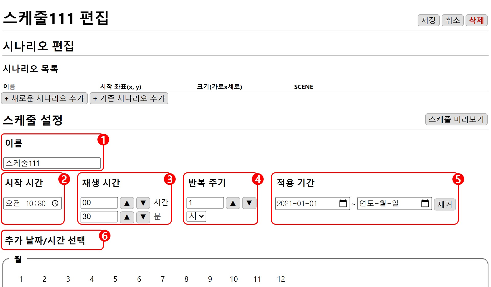
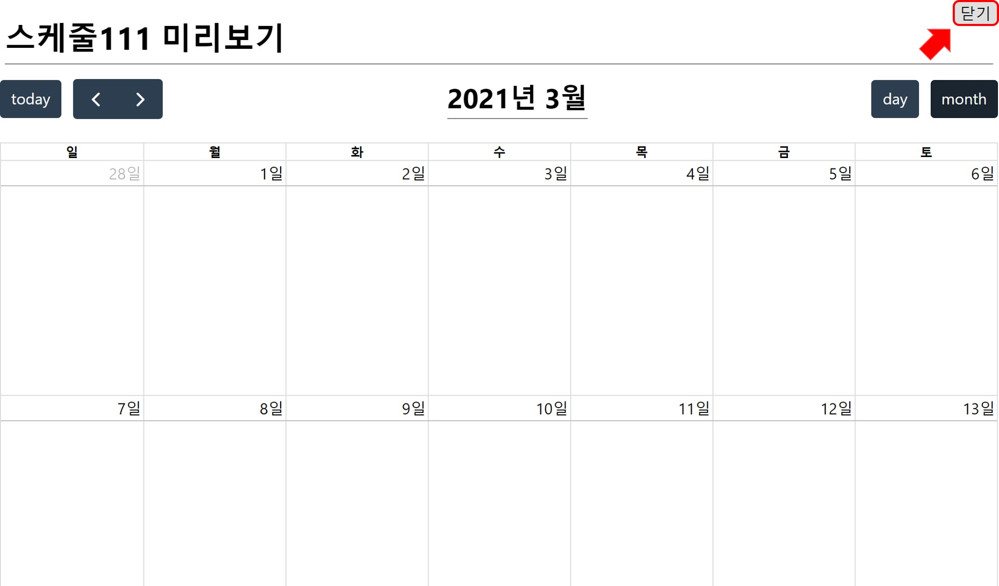

# 스케줄 설정

## 1. 연출 이름
이름은 랜덤으로 설정되기 때문에(편집 화면에서 수정 가능합니다.) 예시 그림의 이름과 다를 수 있습니다.

### 2. 시작 시간
스케줄이 처음으로 시작되는 날의 시간을 설정합니다.

### 3. 재생 시간
시나리오가 재생되는 시간을  `▲` `▼` 버튼을 이용해 1시간, 1분 단위로 조절합니다.  

### 4. 반복 주기
주기에 맞게 시나리오 리스트가 순서대로 다시 재생됩니다. 반복 주기는  `▲` `▼` 버튼을 이용해 조절할 수 있고 단위로 **일**, **주**, **시**, **분**, **월**, **년**을 사용할 수 있습니다.

### 5. 적용 기간
날짜 단위로 스케줄이 적용되는 기간을 선택할 수 있습니다. 종료되는 날짜를 선택하지 않을 시 기한 없이 계속 반복됩니다.
`제거`버튼을 누르면 종료되는 기한이 제거됩니다.

### 6. 추가 날짜/시간 선택
날짜와 시간을 선택해 추가할 수 있고 선택된 것은 다른 색으로 표시되며 다시 누르면 선택을 취소할 수 있습니다.

날짜/시간을 추가하면 **기본 설정된 스케줄**과 **추가된 날짜/시간**이 겹칠 때만 시나리오가 재생됩니다.

자세한 사항은 [재생 시간 설정](repeat.md) 에서 설명하도록 하겠습니다. 

## 스케줄 미리보기
`스케줄 미리보기` 버튼을 누르면 현재 설정된 스케줄을 확인할 수 있습니다.

|`month` 버튼으로 스케줄의 형태를 달별로 확인할 수 있습니다.|`day` 버튼으로 스케줄의 형태를 일별로 확인할 수 있습니다.|
|---|---|
|||

|`today` 버튼을 누르면 현재 날짜로 이동합니다.|`<` `>` 버튼으로 날짜를 이동시킵니다.|
|---|---|
|||

`닫기` 버튼을 누르면 편집 중이던 스케줄로 다시 돌아갑니다.

원하는 형태의 연출이 될때까지 **편집-미리보기** 를 통해 반복적으로 빠른 **수정-확인** 작업이 가능합니다.
