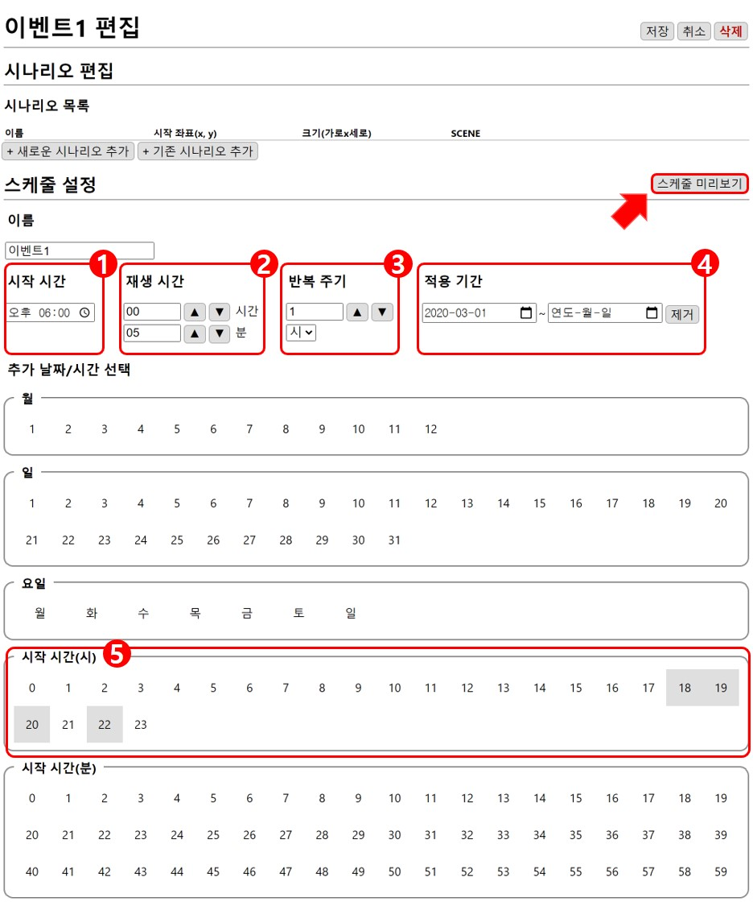
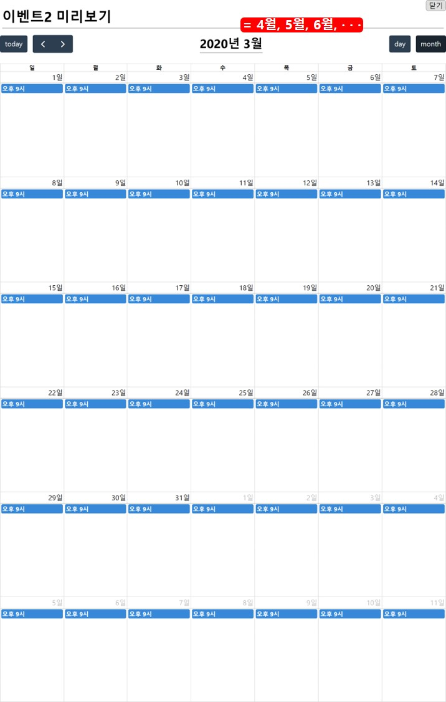
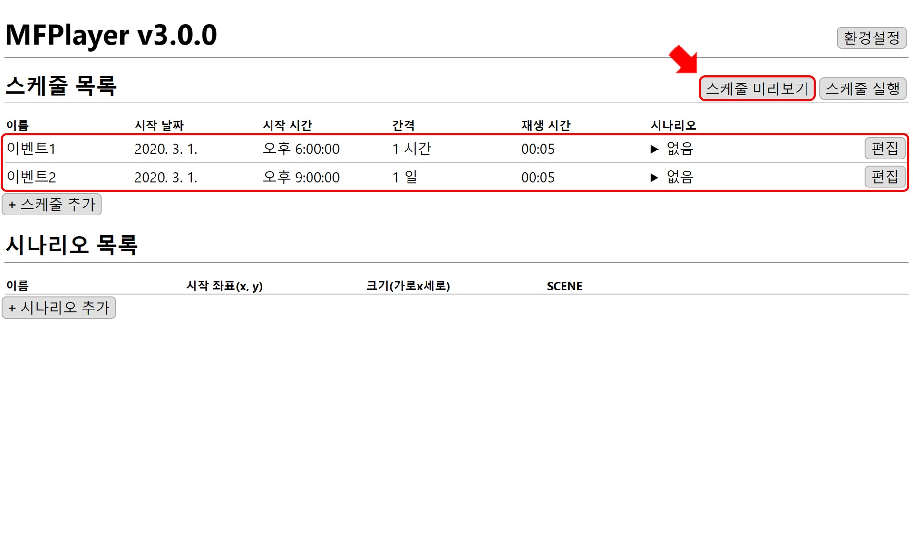
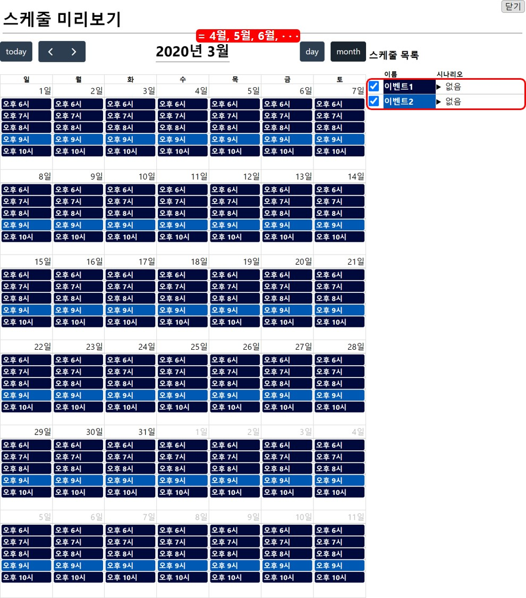
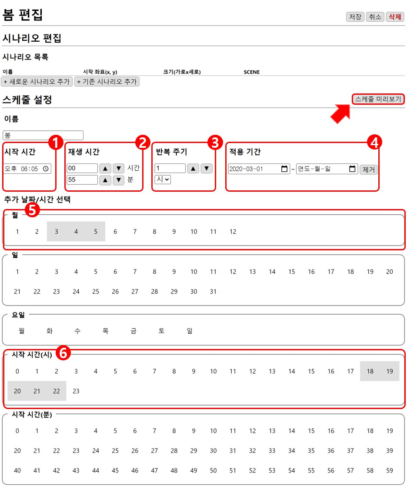
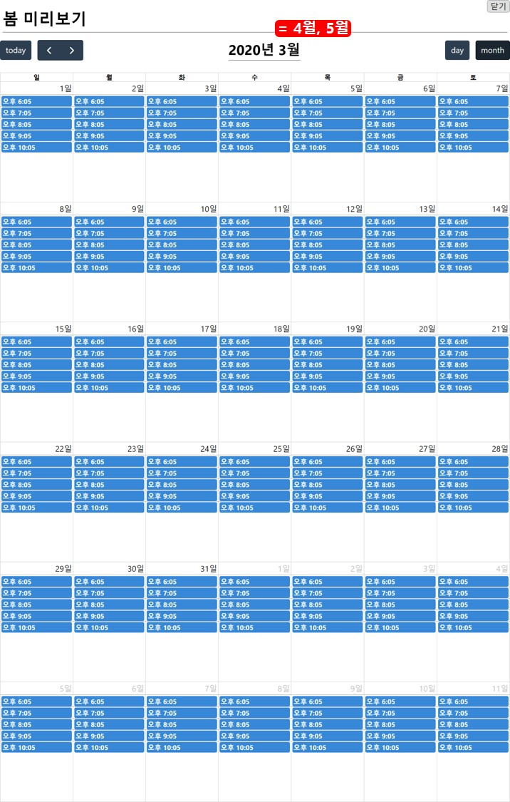
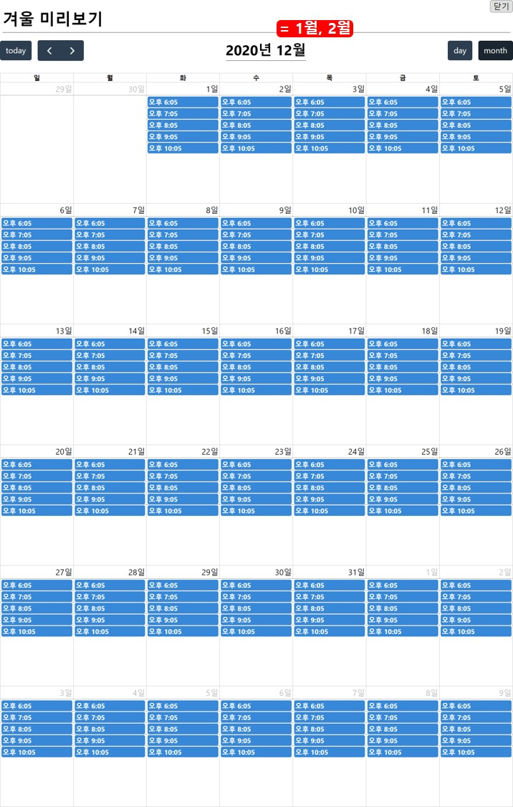

# 예시 1
* 기간 : 2020년 3월 1일부터 매일 오후 6시-11시
* 이벤트 1 : 오후 6시, 7시, 8시, 10시에 5분 동안 재생
* 이벤트 2 : 오후 9시에 5분 동안 재생
* 이벤트 3 : 오후 6시부터 오후 11시까지 계절별로 다른 이벤트가 이벤트 1, 2의 재생시간과 겹치지 않는 시간에 재생

```
- 추가될 시나리오는 매번 변경될 수 있으니 생략하겠습니다.
- 스케줄 이름은 설명을 위한 이름이니 실제와 다를 수 있습니다.
```

## 이벤트 1
1. **오후 6시** 시작
2. **5분** 동안 재생
3. **1시간** 주기로 반복
4. **2020년 3월 1일**부터 기한 없이
5. 하루 종일 1시간을 주기로 반복되는 스케줄 중에**18시, 19시, 20시, 22시**에만 재생
 


`스케줄 미리보기`로 확인하면 매일 오후 6시, 7시, 8시, 10시에 5분 동안 재생되는 것을 확인하실 수 있습니다.


### 이벤트 2
1. **오후 9시** 시작
2. **5분** 동안 재생
3. **1일** 주기로 반복
4. **2020년 3월 1일**부터 기한 없이


`스케줄 미리보기`로 확인하면 매일 오후 9시에 5분 동안 재생되는 것을 확인하실 수 있습니다.




### 이벤트 1, 2 미리보기
홈 화면에서 **이벤트 1, 2**의 전체적인 스케줄을 확인하면 오후 6-11시 사이 매시간 정각에 이벤트가 5분 동안 재생되는 것을 확인하실 수 있습니다.






## 계절 이벤트

### 봄(3월-5월)
1. 이벤트 1이 끝난 **오후 6시 5분**시작
2. 다음 이벤트 (오후 7시) 시작 전까지 재생하기 위해 **55분** 재생
3. **1시간**을 주기로 반복(오후 7시 5분 시작, 오후 8시 5분 시작, ···)
4. **2020년 3월 1일**부터 기한 없이
5. **3월, 4월, 5월**에만 재생
6. 하루 종일 1시간을 주기로 반복되는 스케줄 중에 **18시, 19시, 20시, 21시, 22시**에만 재생



```
tip. 적용 기간을 3-5월로 적용해서 사용할 수 있지만 매년 같은 스케줄을 새로 작성해야 하므로 스케줄 
최적화를 위해 적용 기간을 무제한으로 두고 추가 날짜/시간 선택을 활용합니다.
```

`스케줄 미리보기`로 확인하면 3-5월 동안 매일 오후 6-11시 사이 매시간 5분을 시작으로 55분 동안 재생되는 것을 확인하실 수 있습니다.




### 여름(6월-8월)
봄 이벤트와 동일하고 적용 기간과 추가 날짜 선택만 수정합니다.


`스케줄 미리보기`로 확인하면 6-8월 동안 매일 오후 6-11시 사이 매시간 5분을 시작으로 55분 동안 재생되는 것을 확인하실 수 있습니다.


### 가을(9월-11월), 겨울(12월-2월)
같은 방법으로 가을, 겨울 이벤트를 만듭니다.




### 미리보기
홈 화면에서 **계절 이벤트**의 전체적인 스케줄을 확인하면 매일 오후 6-11시 사이 매시간 5분을 시작으로 55분 동안 재생되는 것을 확인하실 수 있습니다.


### 전체 스케줄 미리보기
스케줄의 시간 형태는 매일 동일하고 계절마다 실행되는 스케줄만 변경됩니다.


