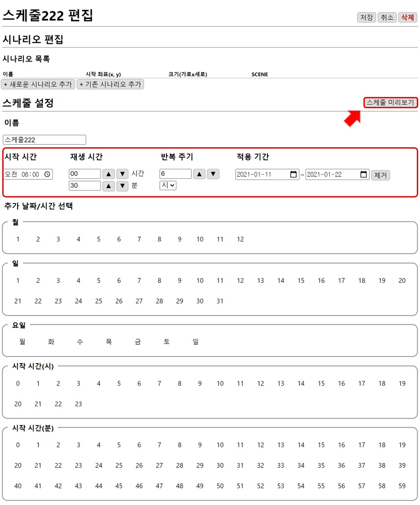
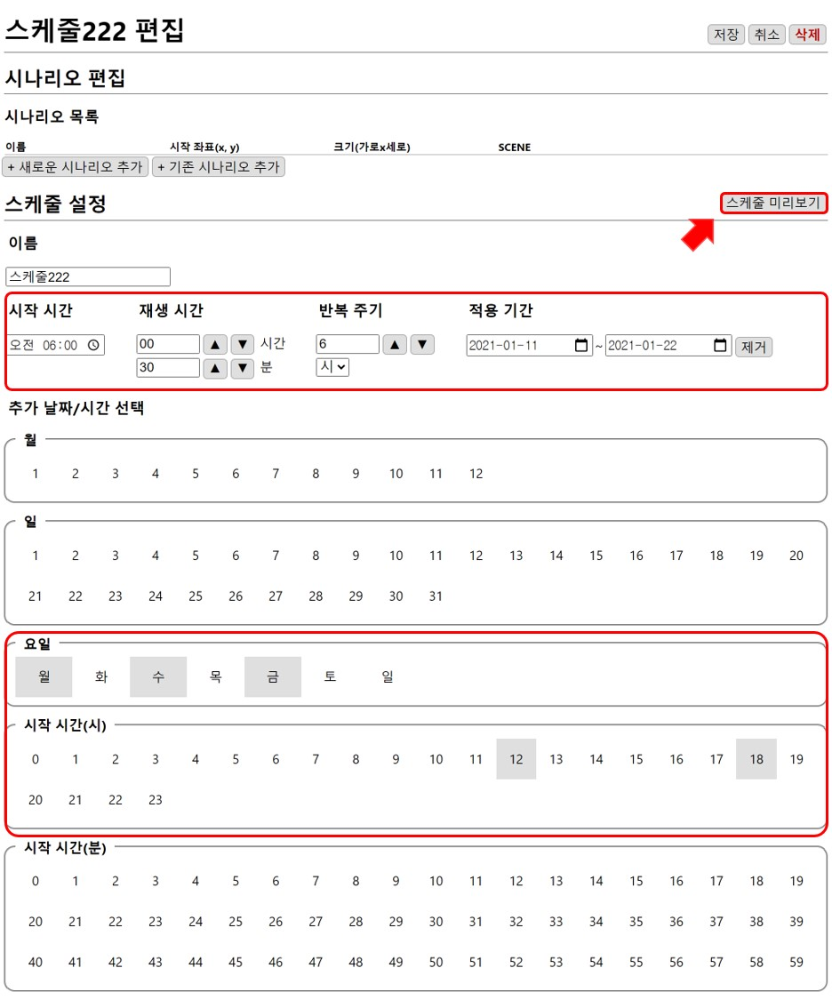

# 재생 시간 설정
스케줄의 재생 시간을 조절해 반복적인 재생을 설정할 수 있습니다.

## 1. 기본 설정
기본적인 시간 설정은 **시작 시간, 재생 시간, 반복 주기, 적용 기간**으로 구성됩니다.

## 2. 추가 날짜/시간 선택
날짜와 시간을 선택해 추가할 수 있고 선택된 것은 다른 색으로 표시되며 다시 누르면 선택을 취소할 수 있습니다.

**1. 기본 설정**된 시간 범위 내에서 **추가 날짜/시간**이 겹치는 동안에만 재생됩니다.

## 반복 재생 설정 이해하기
**기본 설정**을 2021년 1월 11일 오전 12시 00분을 시작으로 2021년 1월 22일까지 6시간을 주기로 2시간 동안 재생되도록 설정하겠습니다.

추가 날짜/시간을 선택하지 않고 `스케줄 미리보기`로 확인하게 되면 2021년 1월 11일부터 2021년 1월 22일까지 매일 6시간을 주기로 **오전 12시**, **오전 6시**, **오후 12시**, **오후 6시**에 재생되는 것을 확인할 수 있습니다.

*스케줄 수정 후 이미지 추가*

이 스케줄 중에 **월요일, 수요일, 금요일**과 **오후 12시, 오후 6시** 에만 재생을 하려고 한다면 **추가 날짜/시간** 을 통해 재생하고 싶은 시간을 선택하면 됩니다.

`스케줄 미리보기`로 확인하게 되면 2021년 1월 11일부터 2021년 1월 22일까지 **월요일, 수요일, 금요일**과 **오후 12시, 오후 6시**에만 재생되는 것을 확인할 수 있습니다.

스케줄의 범위가 넓고 다양할 때는 **월**, **일**, **요일**, **시작 시간(시간)**, **시작 시간(분)** 단위로도 선택 가능합니다.
