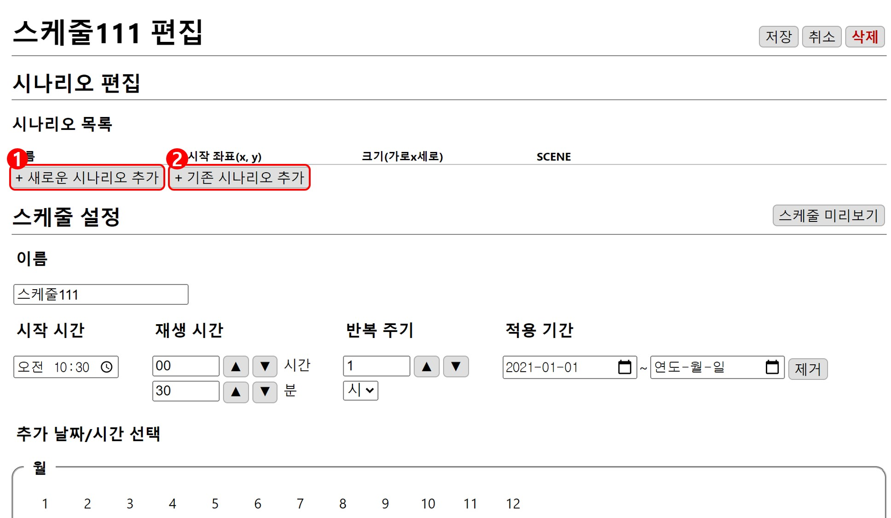
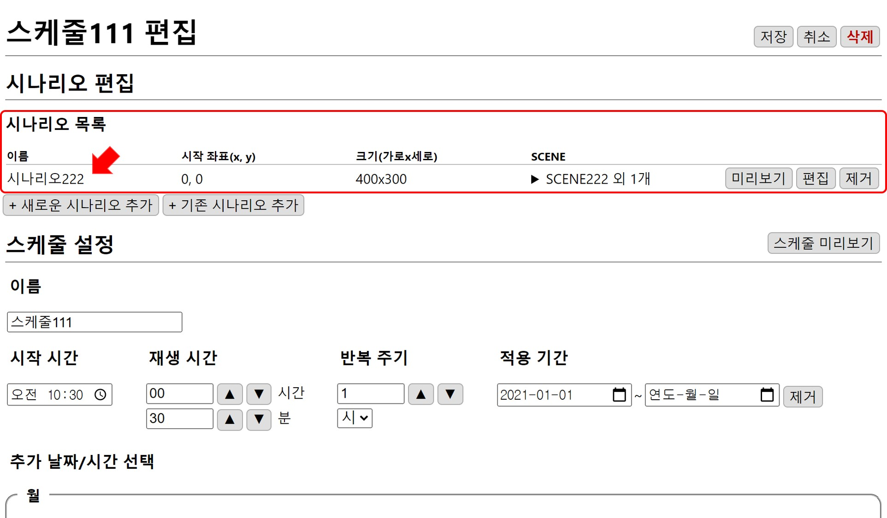
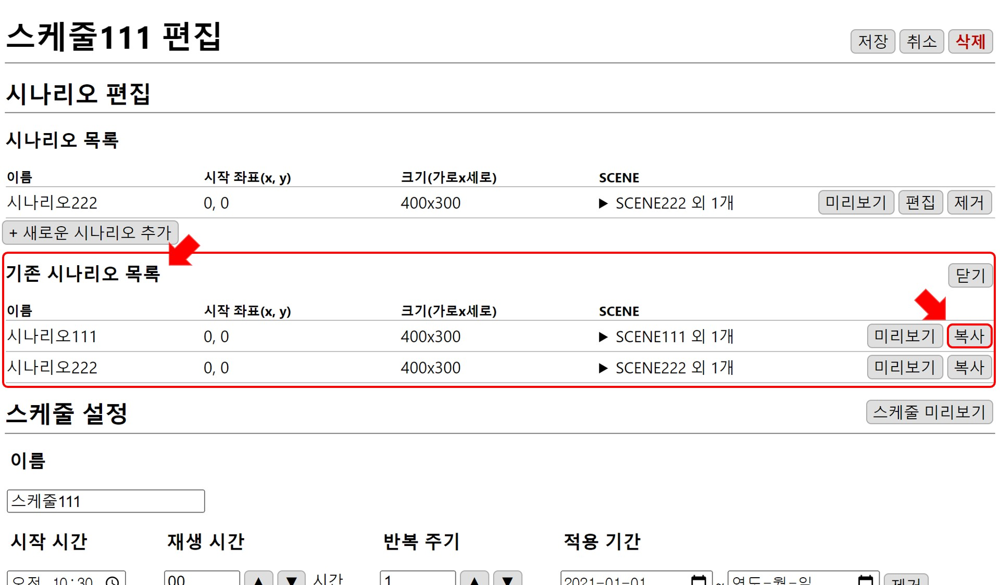

# 시나리오 편집
스케줄에 시나리오를 입력합니다.

## 시나리오 추가 
스케줄에 시나리오를 입력하는 방법은 새롭게 만들어서 추가하는 방법인 **1. 새로운 시나리오 추가**와 기존에 만든 시나리오를 추가하는 **2. 기존 시나리오 추가** 방법이 있습니다. 

### 1. 새로운 시나리오 추가
`+ 새로운 시나리오 추가`버튼을 누르면 시나리오 편집창으로 이동합니다.

`저장`하면 스케줄의 **시나리오 목록**에 추가됩니다.

### 2. 기존 시나리오 추가
`+ 기존 시나리오 추가`버튼을 누르면 이전에 만들었던 **기존 시나리오 목록**이 나타납니다.

추가할 시나리오를 `복사`하면 **시나리오 목록**에 추가됩니다. 중복으로 추가할 수 없습니다.

시나리오 목록의 순서는 시나리오가 만들어진 시간 순서대로 추가되며 조정할 수 없습니다.
