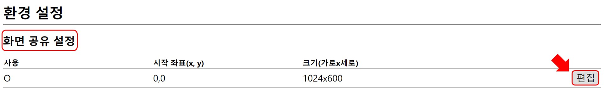
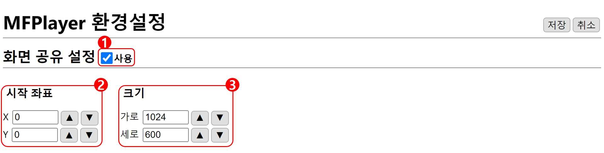
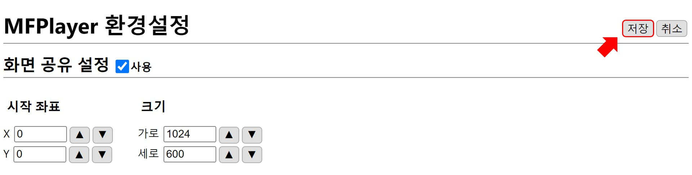
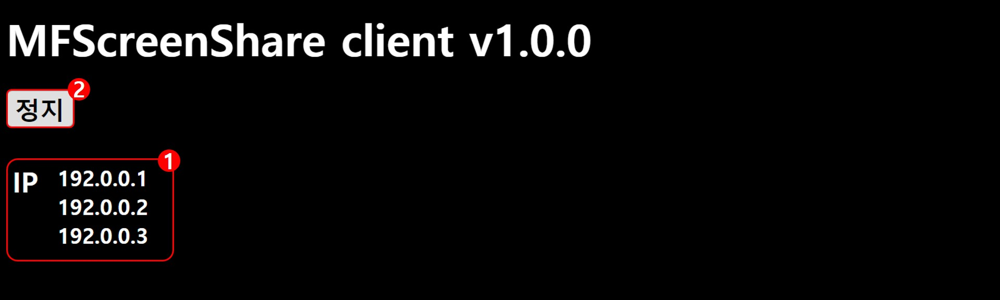
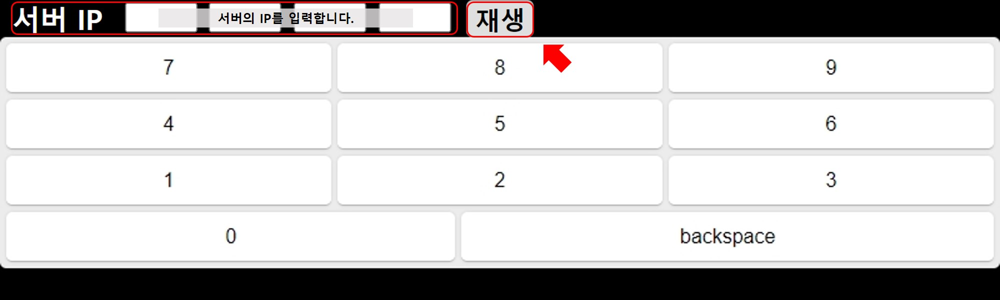
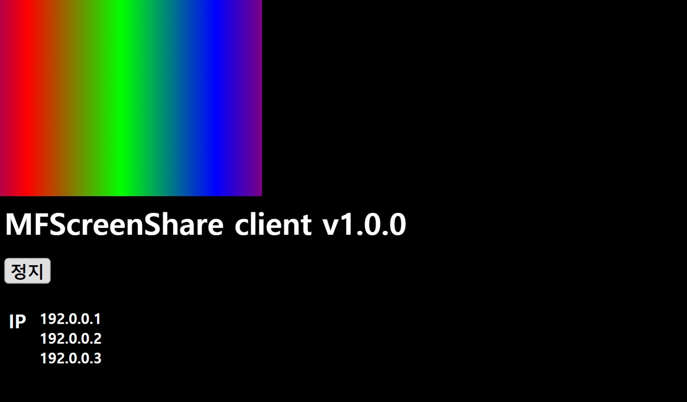

# 화면 공유
화면 공유 서버의 화면을 클라이언트로 공유할 수 있습니다.

## 화면 공유 서버
화면 공유를 시작하기 위해 `편집` 버튼을 눌러 화면 공유 서버의 환경을 설정합니다.

### 화면 공유 서버 설정

### 1. 사용
화면 공유 기능의 사용 여부를 결정합니다. 체크 되어있는 설정을 저장 하면 서버의 화면을 공유를 시작합니다.

### 2. 시작 좌표
공유될 화면의 왼쪽 위 모서리(0, 0)를 기준으로 (x, y) 좌표를 설정합니다.

### 3. 크기
설정한 **2. 시작 좌표**를 기준으로 화면의 크기를 설정합니다.

## 화면 공유 클라이언트
클라이언트는 재생화면을 공유 받습니다.

### 1. IP
내 IP를 확인할 수 있습니다.

### 2. 정지
`정지`버튼을 누르면 공유 받기 위한 IP를 입력할 수 있는 화면으로 이동합니다.

화면에서 화면 공유 서버의 IP를 입력하고 `재생` 버튼을 누르면 서버의 화면이 재생됩니다.

