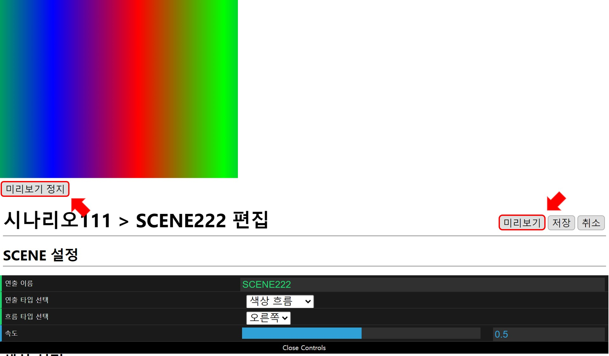

# 시나리오에 연출 더하기
시나리오는 여러 SCENE 들의 모음으로 구성됩니다.  
원 대각선 흐름을 만들었던 시나리오에 색상 흐름 SCENE 을 더하는 방법을 통해 시나리오 기본 작성 방법을 소개하겠습니다.  
시나리오는 아래의 편집 과정을 거쳐 원이 대각선으로 흐르는 연출 이후에 색상 흐름 연출로 이어지는 동작을 수행하게 됩니다.  

## 색상 흐름 연출
색상이 흐름 연출은 선택한 색상들이 점진적으로 연결되어 반복 형태로 흐르는 연출입니다.

## 시나리오 편집
[대각선 흐름 연출 만들기](circleDiagonal.md) 에서 만들어진 시나리오의 `편집` 버튼을 클릭합니다.

## SCENE 추가 
시나리오 편집 페이지에서 `새로운 SCENE 추가` 버튼을 누릅니다.

## SCENE 설정
[대각선 흐름 연출 만들기](circleDiagonal.md) 와 마찬가지로
`미리보기` 버튼을 통해 반복적인 수정 - 확인 과정 이후에 `저장` 버튼을 누르면 됩니다.

### 연출 타입 선택
색상을 설정하기 위해서 `색상 흐름` 을 선택합니다.  
예제에서는 `색상 흐름`으로 설정할때 같이 설정되는 **흐름 방향** 과 **색상** 의 기본 값을 그대로 사용하겠습니다.  
**흐름 방향** 과 **색상** 에 대해서는 [SCENE 상세 편집](../scene/edit.md) 에서 자세하게 설명하겠습니다.  

### SCENE 미리보기
`미리보기` 버튼을 눌러 색상 흐름 연출이 정상적으로 동작하는 것을 확인합니다.

## SCENE 저장
`저장` 버튼을 누릅니다.

시나리오에 `색상 흐름` 연출 타입의 SCENE 이 추가된 것을 확인할 수 있습니다.  
SCENE 이름은 랜덤으로 자동 설정되기 때문에 예시와 다를 수 있습니다.  
SCENE 이름 설정은 [SCENE 상세 편집](../scene/edit.md) 에 자세하게 설명되어 있습니다.  

## 시나리오 저장
`저장` 버튼을 눌러 시나리오 편집을 완료합니다.

## 재생
`단독 재생` 버튼을 눌러 편집 내용을 확인합니다.  
원 대각선 흐름이 5 초간 재생되고, 이어서 색상 흐름 연출이 5 초 동안 재생됩니다.

색상 흐름 연출 이후에 원 대각선 흐름 재생이 다시 시작되는것도 확인 할수 있습니다.  
모든 시나리오는 멈추지 않고 반복 재생됩니다.

제어창에서 `정지` 버튼을 눌러 다시 편집창으로 돌아갑니다.

시나리오에 새로운 SCENE 추가하기가 **완료**되었습니다.

이어지는 페이지에서 시나리오의 기본 설정을 변경하는 기능을 설명하겠습니다.  
[시나리오 설정하기](./scenario.md)
