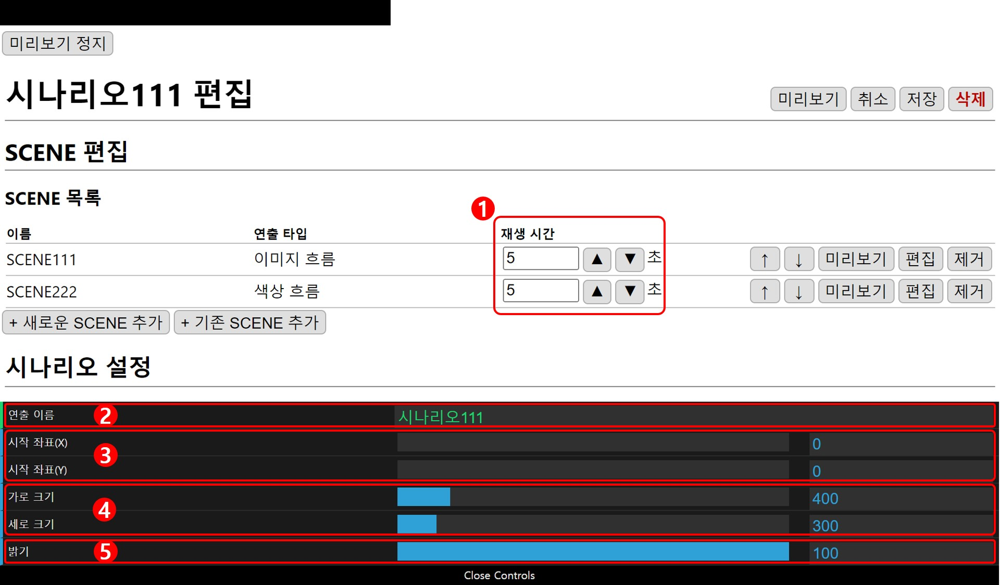
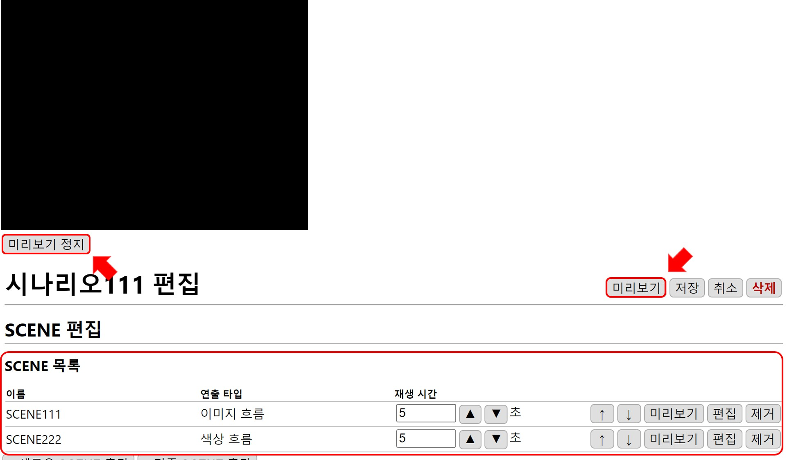
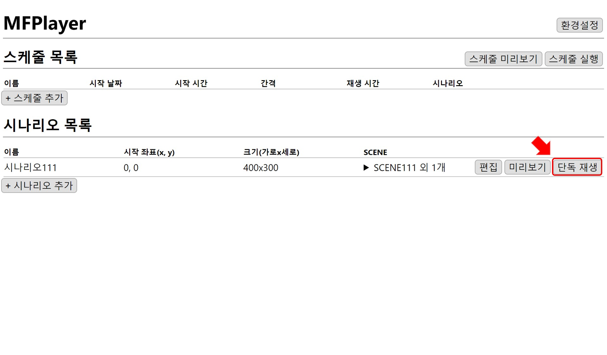
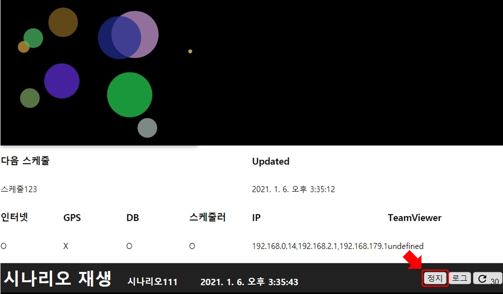

# 시나리오 설정하기
시나리오의 기본 설정 방법 예제입니다.

## 시나리오 설정

### 1. 재생 시간
SCENE의 재생 시간을  `▲` `▼` 버튼을 이용해 0.1 초 단위로 조절합니다.  
한 개 SCENE을 최소 0.5초, 최대 86400초(24시간)으로 설정할 수 있습니다.  

### 2. 시나리오 이름 
시나리오 이름은 랜덤으로 설정되기 때문에(편집 화면에서 수정 가능 합니다.) 예시 그림의 이름과 다를 수 있습니다.

### 3. 재생 화면 위치
왼쪽 위 모서리(0,0)를 기준으로 (x,y) 좌표를 설정할 수 있습니다.

### 4. 재생 화면 크기
시나리오에서 SCENE이 재생될 크기를 설정합니다.

### 5. 밝기
시나리오의 전체 밝기를 설정합니다.

## 시나리오 미리보기
SCENE 목록 설정 순서대로 재생됩니다.

시나리오 편집 완료 후 `미리보기` 버튼을 누르면 재생 화면이 나타나 편집 결과를 확인할 수 있습니다.
`미리보기 정지` 버튼을 누르면 재생 화면이 닫힙니다.

## 단독 재생

홈 화면의 목록에서 `단독 재생` 버튼을 누르면 편집창이 닫히고, 시나리오의 첫 번째 SCENE이 재생되기 시작합니다.

시나리오가 재생되면서 하단에 제어창이 열립니다. 제어창에서 `정지` 버튼을 누르면 다시 편집창으로 돌아갈 수 있습니다.

## 재생 시간 제어
스케줄 재생을 이용하면 시나리오의 재생시간이 제어됩니다.  
스케줄 재생 챕터에서 재생 시간 설정에 대한 자세한 내용을 설명하겠습니다.  

[스케줄 만들기](./schedule.md)
