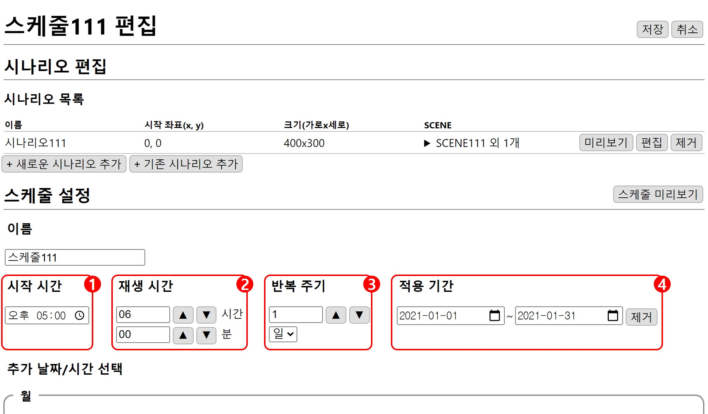
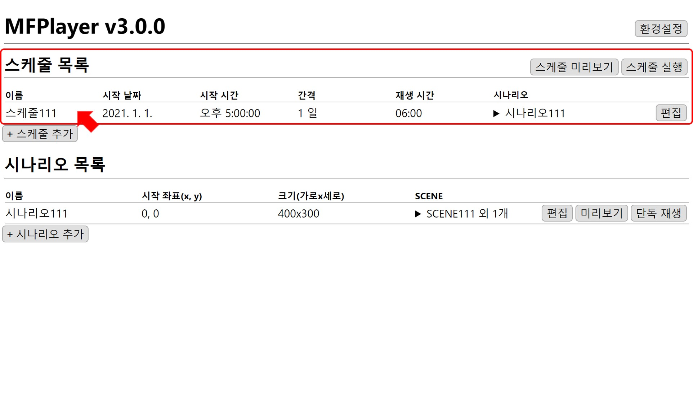

# 스케줄 만들기
MFPlayer의 연출은 시나리오를 조합해 스케줄에 설정된 시간에 따라 재생됩니다.

2021년 1월 동안 매일 오후 5시 ~ 11시에 재생되는 스케줄 예제를 작성해 보겠습니다.

## 스케줄 추가
편집 창의 홈 화면에서 `스케줄 추가` 버튼을 클릭합니다.

## 시나리오 추가
앞의 예제에서 만든 시나리오를 스케줄에 추가하기 위해 **새로운 시나리오 추가**, **기존 시나리오 추가** 중 `기존 시나리오 추가`버튼을 누릅니다.

버튼을 누르면 기존에 만든 시나리오 목록이 펼쳐지고 `복사`버튼을 눌러 시나리오를 스케줄에 추가합니다.

시나리오 목록에 복사한 시나리오가 추가된 것을 확인할 수 있습니다.  

##  스케줄 설정

### 1. 시작 시간
시작시간을 오후 5:00 으로 설정합니다.

### 2. 재생 시간
시나리오가 재생되는 시간을  `▲` `▼` 버튼을 이용해 1시간, 1분 단위로 조절 가능합니다.
오후 11:00 까지 재생하기 위해 **6시간**으로 설정합니다.

### 3. 반복 주기
주기에 맞춰 첫 시나리오부터 순서대로 재생됩니다.
반복 주기는`▲` `▼` 버튼을 이용해 숫자를 조절할 수 있고 매일 재생을 위해 **1일**로 설정합니다.

### 4. 적용 기간
1월 동안 재생하기 위해 2021-01-01 ~ 2021-01-31로 설정합니다.

## 스케줄 미리보기
`스케줄 미리보기` 버튼을 누르면 현재 설정된 스케줄을 확인할 수 있습니다.

원하는 형태의 연출이 될 때까지 **편집-스케줄 미리보기**를 통해 반복적으로 빠른 **수정-확인** 작업이 가능합니다.

매일 오후 5시에 스케줄이 실행되는 것을 확인할 수 있습니다.

## 스케줄 저장
`저장` 버튼을 눌러 스케줄을 저장합니다.

스케줄 목록에 매일 오후 5시부터 6시간 동안 실행되는 스케줄이 추가된 것을 확인할 수 있습니다.

