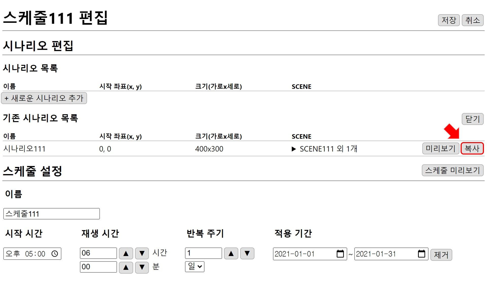
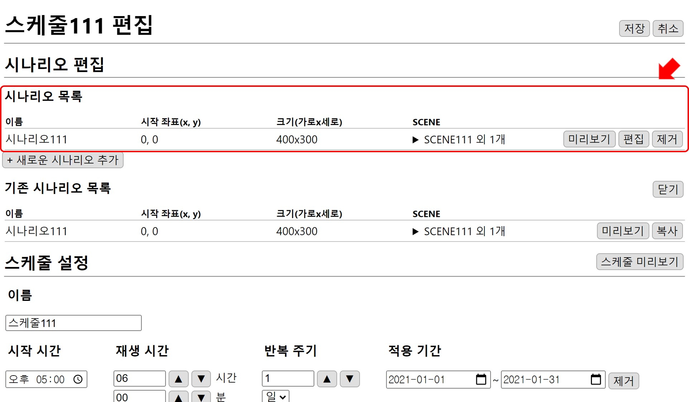
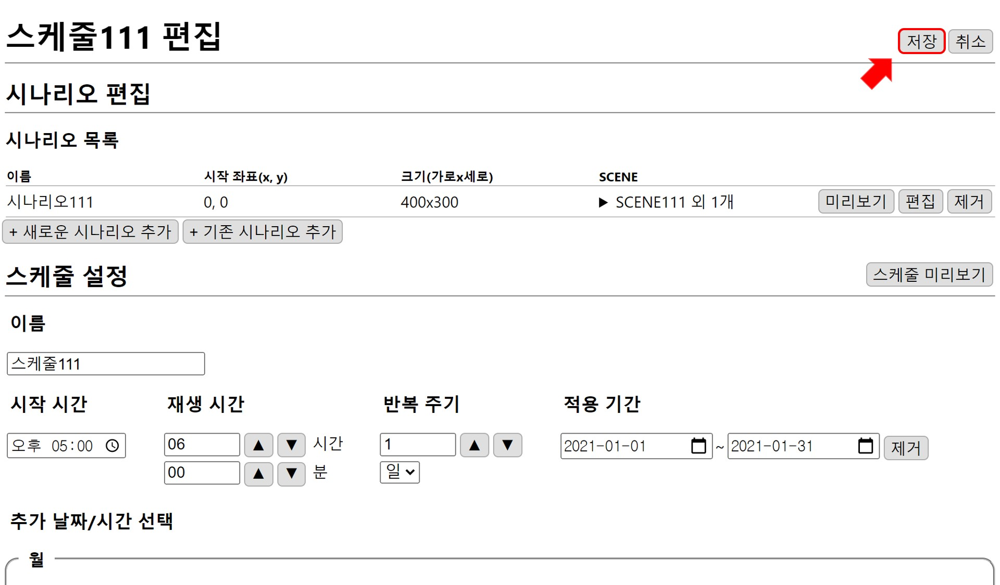

# 스케줄 만들기
MFPlayer의 연출은 시나리오를 조합해 스케줄에 설정된 시간에 따라 재생됩니다.  
스케줄을 설정하는 예제를 통해 재생해보도록 하겠습니다.

## 스케줄 추가
편집 창의 홈 화면에서 `스케줄 추가` 버튼을 클릭합니다.

## 시나리오 추가
앞의 예제에서 만든 시나리오를 스케줄에 추가하기 위해 **새로운 시나리오 추가**, **기존 시나리오 추가** 중 `기존 시나리오 추가`버튼을 누릅니다.

버튼을 누르면 기존에 만든 시나리오 목록이 펼쳐지고 `복사`버튼을 눌러 시나리오를 스케줄에 추가합니다.

시나리오 목록에 복사한 시나리오가 추가된 것을 확인할 수 있습니다.  

##  스케줄 설정

### 1. 스케줄 이름
스케줄 이름은 랜덤으로 설정되기 때문에(편집 화면에서 수정 가능 합니다.) 예시 그림의 이름과 다를 수 있습니다.

### 2. 시작 시간
스케줄이 처음으로 시작되는 시간을 설정합니다.

### 3. 재생 시간
시나리오가 재생되는 시간을  `▲` `▼` 버튼을 이용해 1시간, 1분 단위로 조절합니다.  

### 4. 반복 주기
주기에 맞춰 첫 시나리오부터 순서대로 재생됩니다.
반복 주기는  `▲` `▼` 버튼을 이용해 조절할 수 있고 단위로 **일**, **주**, **시**, **분**, **월**, **년**을 사용할 수 있습니다.

### 5. 적용 기간
날짜 단위로 스케줄이 적용되는 기간을 선택할 수 있습니다. 

### 6. 추가 날짜/시간 선택
날짜와 시간을 선택해 추가할 수 있고 선택된 것은 다른 색으로 표시됩니다.  
설정된 스케줄과 추가된 날짜와 시간이 겹칠 때 실행되고 시나리오가 재생됩니다.

### 스케줄 미리보기
`스케줄 미리보기` 버튼을 누르면 현재 설정된 스케줄을 확인할 수 있습니다.

### 스케줄 이해

추가 날짜/시간을 선택하지 않았을 때 스케줄을 확인하면 2021년 1월 1일 오전 10시 30분을 시작으로 2021년 1월 31일까지 2시간을 주기로 30분 동안 시나리오가 재생됩니다.

추가 날짜/시간을 선택하면 설정된 스케줄 안의 범위에서 추가된 10일, 20일, 8시, 18시, 0분, 30분과 겹칠 때만 스케줄이 실행된다는 것을 확인할 수 있습니다.

원하는 형태의 연출이 될 때까지 **편집-스케줄 미리보기** 를 통해 반복적으로 빠른 **수정-확인** 작업이 가능합니다.

## 스케줄 저장
`저장` 버튼을 눌러 스케줄을 저장합니다.

스케줄 목록에 스케줄이 추가된 것을 확인할 수 있습니다.

